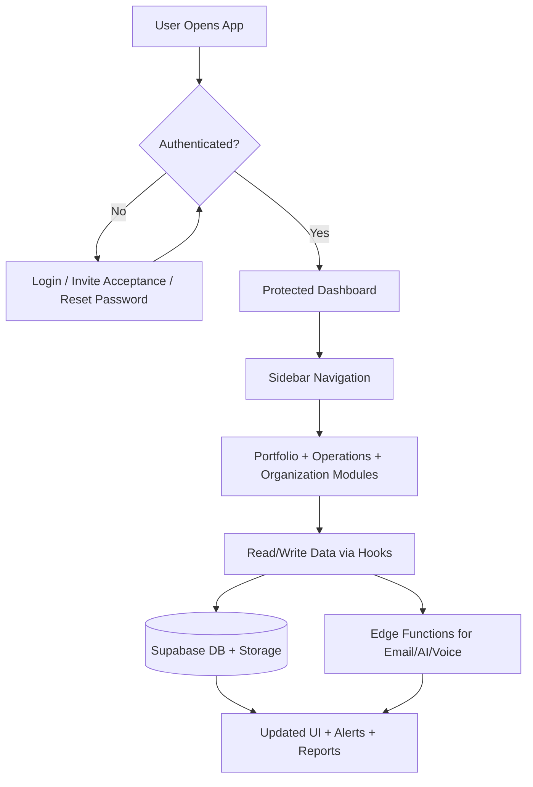
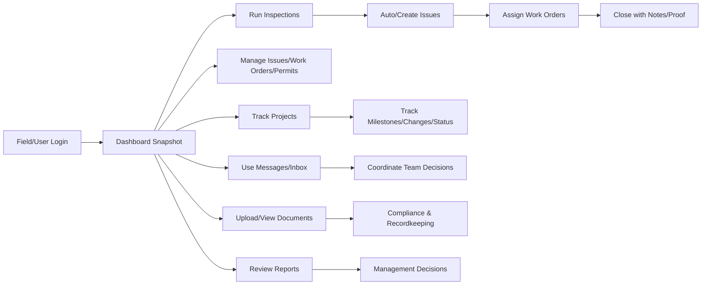

# Glorieta Gardens - App Flow, Feature Overview, and User Value

## Purpose of This Document
This document explains:
- How the app works end-to-end
- What features exist and why they exist
- How each feature helps users in real operations

---

## 1) How the App Works (High-Level Flow)

### Access Control Behavior
- `Admin`: sees all properties and global data.
- `Owner + Non-Admin Roles`: sees only associated property data.
- Sidebar modules are shown based on role permissions and enabled modules.

---

## 2) User Journey Flow (Practical)

---

## 3) Feature List, Why It Exists, and User Benefit

| Feature Area | Why It Exists | How It Helps a User |
|---|---|---|
| Authentication + Invite Access | Secure, controlled access to tenant environment | Only authorized staff can enter; easier onboarding via invitation links |
| Role-Based Access Control | Prevent users from seeing/changing unauthorized data | Reduces risk, keeps workflows relevant, supports compliance |
| Property-Scoped Access | Multi-property organizations need separation by assignment | Users focus on their sites; avoids cross-property data leakage |
| Dashboard | Central operational snapshot | Users immediately see what needs attention |
| Properties/Units/Assets | Portfolio inventory and context | Creates a single source of truth for sites, units, and physical assets |
| Daily Grounds Inspections | Standardized recurring field checks | Finds issues early, creates traceable inspection history |
| NSPIRE Inspections | Compliance-focused inspection workflow | Improves preparedness and standardization for audit/compliance outcomes |
| Issues Management | Track and prioritize operational problems | Faster resolution through clear ownership and status tracking |
| Work Orders | Execute and close maintenance tasks | Better accountability, assignment clarity, and completion evidence |
| Permits & Compliance | Track permit lifecycle and obligations | Avoids missed deadlines and compliance penalties |
| Projects Module | Manage capital and improvement work (e.g., sewer/building extension) | Gives owners/managers a structured way to plan, execute, and monitor projects |
| People & Role Management | Manage team members and access | Ensures the right people have the right permissions |
| Messaging | Internal collaboration by thread | Reduces communication gaps and keeps context attached to work |
| Email Inbox | Operational email handling inside platform | Avoids fragmented communication tools |
| Documents & Archives | Centralize operational/compliance files | Improves retrieval speed and record integrity |
| Reports | Convert raw operations into decision-ready insights | Supports leadership reviews, planning, and accountability |
| Training | Role-targeted learning and progress tracking | Improves consistency and staff readiness |
| Voice Agent | Capture/triage maintenance requests through voice flow | Accelerates intake and can reduce response delays |
| QR Tools | Fast asset identification in the field | Improves speed/accuracy of inspections and maintenance workflows |

---

## 4) Core Workflow Examples

### A) Inspection to Resolution
1. User performs inspection.
2. Defect/issue is logged.
3. Work order is assigned.
4. Team executes and updates status.
5. Completion proof is attached.
6. Managers review closure and reporting.

### B) Project Execution (Owner/Manager)
1. Create project for a property.
2. Add milestones, RFIs, submittals, and change orders.
3. Track progress, safety, procurement, and closeout.
4. Use reports for budget/status decisions.

### C) Compliance Tracking
1. Add permit and requirements.
2. Track due dates/deliverables.
3. Receive visibility on expiring/compliance risk.
4. Preserve documentation for audit-readiness.

---

## 5) Value by User Type

| User Type | Primary Value |
|---|---|
| Admin | Global oversight, governance, and system-level control |
| Owner | Property-scoped operational + project visibility, strategic decisions |
| Manager/Superintendent | Day-to-day execution, team coordination, faster issue closure |
| Inspector/Field Staff | Structured inspections, clear assignments, reduced manual tracking |
| Clerk/Support Staff | Better organization of documents, communication, and follow-up |

---

## 6) Why This Product Matters
- Reduces operational fragmentation across inspections, maintenance, projects, and compliance.
- Improves accountability through role-based workflows and auditable status trails.
- Enables faster decisions with integrated reporting and real-time operational visibility.
- Scales with portfolio growth using modular architecture and property-scoped controls.

---

## 7) Recommended Next Evolution
- Add production billing and entitlement automation for module monetization.
- Replace static organization settings with editable tenant configuration.
- Complete runtime verification for Google OAuth provider/callback configuration.
- Add KPI/SLA dashboards for response-time and completion performance targets.

