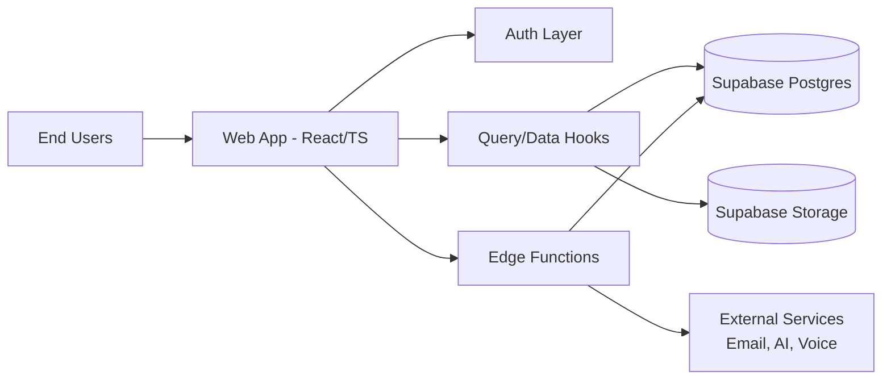
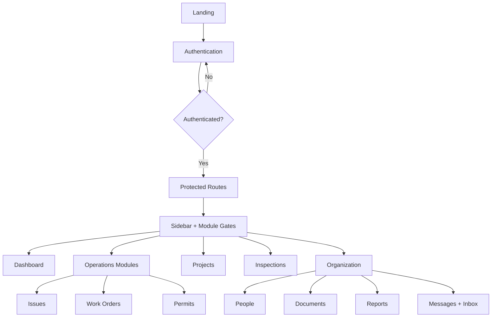

# Glorieta Gardens - Nspire Guardian Hub
## Live Product Requirements Document (PRD)

| Field | Value |
|---|---|
| Document Type | Live PRD (Incremental, Code-Verified) |
| Product | Nspire Guardian Hub |
| Tenant/Brand | Glorieta Gardens |
| Environment | Web (React + TypeScript + Supabase) |
| Current Version | v1.0.0-live |
| Last Updated | February 17, 2026 |
| Maintainer | Product + Engineering |
| Update Cadence | Weekly or per release |
| Source of Truth | Codebase + Supabase schema + deployment config |

---

## Status Legend

| Status | Badge | Definition |
|---|---|---|
| Implemented | Implemented | Built, wired, and verifiable in current repository |
| Partial | Partial | Built in part, but has placeholders, external dependency, or missing production verification |
| Pending | Pending | Not implemented or not verifiable from current repository |

---

## 1. Product Overview

### 1.1 Vision
Nspire Guardian Hub is a property operations platform for multifamily management, inspections, compliance, projects, occupancy, and team collaboration under a single role-controlled operating interface.

### 1.2 Objectives
| Objective ID | Objective | Success Indicator |
|---|---|---|
| OBJ-01 | Centralize property operations workflows | Core modules are accessible in one authenticated application |
| OBJ-02 | Enforce role and property-based access boundaries | Admin sees global data; non-admin roles see associated-property data only |
| OBJ-03 | Support operational execution end-to-end | CRUD and workflow coverage exists for inspections, issues, work orders, permits, projects |
| OBJ-04 | Enable collaboration | Messaging, notifications, documents, and reporting are integrated |
| OBJ-05 | Support extensibility | Edge functions, modular hooks, and route-based architecture are in place |

### 1.3 Non-Goals (Current Scope)
| Item | Status |
|---|---|
| Full production billing/payment workflow | Partial |
| Fully dynamic organization profile/config management | Partial |
| Guaranteed Google OAuth runtime config verification from repo only | Partial |

---

## 2. User & Role Model

### 2.1 Role Hierarchy (App Roles)
`admin`, `owner`, `manager`, `inspector`, `administrator`, `superintendent`, `clerk`, `project_manager`, `subcontractor`, `viewer`, `user`

### 2.2 Scope Enforcement (Current)
| Role Class | Data Scope |
|---|---|
| Admin | Global (all properties) |
| Owner | Associated properties only |
| All other non-admin roles | Associated properties only |

### 2.3 Permission Engine
- Role permissions resolved through `role_permissions`
- Permission checks exposed via `useUserPermissions`
- UI feature gates + data-hook scope checks are both implemented

---

## 3. High-Level Architecture

### 3.1 Stack
| Layer | Technology |
|---|---|
| Frontend | React, TypeScript, Vite |
| State/Data | TanStack React Query |
| Auth + DB + Storage | Supabase |
| Serverless Logic | Supabase Edge Functions |
| UI | Componentized shadcn/Radix-based system |
| Routing | React Router |

### 3.2 Architecture Diagram

### 3.3 App Navigation / Runtime Flow

---

## 4. Functional Scope Matrix (Code-Verified)

| Domain | Capability | Status | Notes |
|---|---|---|---|
| Platform | Route-based app composition | Implemented | `src/App.tsx` |
| Platform | Error boundary | Implemented | Global boundary present |
| Platform | React Query data layer | Implemented | Hooks across modules |
| Authentication | Protected route redirect | Implemented | Unauthenticated users redirected to `/auth` |
| Authentication | Email/password sign-in | Implemented | `supabase.auth.signInWithPassword` |
| Authentication | Password reset pages | Implemented | Forgot + Reset routes/pages |
| Authentication | Invite accept flow | Implemented | `/accept-invite/:token` |
| Authentication | Google OAuth frontend wiring | Partial | Button + OAuth call path exists; runtime config external |
| Authorization | Role permissions engine | Implemented | `role_permissions` + `usePermissions` |
| Authorization | Admin global visibility | Implemented | Shared hooks enforce admin global scope |
| Authorization | Owner scoped visibility | Implemented | Owner no longer global; scoped to associations |
| Navigation | Dynamic sidebar module gating | Implemented | Permission + module toggles |
| Identity UX | Header roles + initials dynamic | Implemented | No static role/initials |
| Properties | List/read/create/update/delete | Implemented | `useProperties` mutations present |
| Units | CRUD + CSV import | Implemented | `useUnits` + import support |
| Assets | CRUD + asset type defs | Implemented | `useAssets` |
| Occupancy | Tenants management flows | Implemented | `useTenants`, dialogs, detail sheet |
| Daily Grounds | Inspection workflow/history/review | Implemented | Daily inspection pages + hooks |
| NSPIRE | Inside/outside/unit inspections | Implemented | Dedicated routes/pages/hooks |
| Issues | CRUD + comments + mentions | Implemented | `useIssues`, `useIssueComments`, `useIssueMentions` |
| Work Orders | CRUD + assign + close + comments/activity | Implemented | `useWorkOrders`, comments/activity hooks |
| Projects | Dashboard/list/detail/create/edit/delete | Implemented | `useProjects` + routes |
| Projects | Milestones/RFIs/Submittals/Punch/CO | Implemented | Dedicated hooks/components |
| Projects | Owner can access project tab/create | Implemented | Permission fallback for owner projects view/create |
| Permits | Dashboard/detail + CRUD | Implemented | `usePermits` + pages |
| Permits | Requirements + deliverables workflows | Implemented | Dedicated hooks implemented |
| People | List/detail/property assignment | Implemented | `usePeople` + assignment mutations |
| People | Admin all users, non-admin associated users | Implemented | People data scoping updated |
| Documents | Document center + upload + folders | Implemented | `useDocuments`, `useDocumentFolders` |
| Archives | Property archive upload/view | Implemented | `usePropertyArchives` + pages |
| Reports | Org + personal reporting pages | Implemented | Reports page + report components |
| Messaging | Internal thread messaging | Implemented | Threads, participants, message hooks |
| Email | Inbox list/detail/actions/compose | Implemented | Mailbox components + hooks |
| Notifications | Notification center + hooks | Implemented | Realtime-style UI support |
| Training | Course/resource/progress/request flows | Implemented | Training hooks and components |
| Voice Agent | Dashboard, queue, request detail, widget | Implemented | Voice agent module and hooks present |
| QR | Scanner + QR generation | Implemented | QR page/components present |
| Settings | Module toggles, users/roles, billing tab, org tab | Partial | Billing/org sections include placeholder/static aspects |

---

## 5. Detailed Implementation Checklists

## 5.1 Authentication & Identity
| Item | Status | Evidence |
|---|---|---|
| Auth provider/context | Implemented | `src/hooks/useAuth.tsx` |
| Session listener | Implemented | `onAuthStateChange` in auth hook |
| Protected routes | Implemented | `src/components/auth/ProtectedRoute.tsx` |
| Email/password login | Implemented | `signInWithPassword` |
| Invite acceptance | Implemented | `src/pages/auth/AcceptInvitePage.tsx` |
| Google OAuth frontend flow | Partial | `src/pages/auth/AuthPage.tsx`, `src/integrations/lovable/index.ts` |

## 5.2 Access Control & Scoping
| Item | Status | Evidence |
|---|---|---|
| Permission resolver | Implemented | `src/hooks/usePermissions.ts` |
| Property-scoped data hooks | Implemented | `useProperties`, `useProjects`, `usePermits`, `usePeople`, etc. |
| Owner scoped like non-admin | Implemented | Shared hooks updated to admin-only global bypass |
| Project access for owner | Implemented | Owner fallback in permissions for `projects:view/create` |

## 5.3 Operations (Inspections, Issues, Work Orders)
| Subsystem | Status | Technical Notes |
|---|---|---|
| Daily inspections | Implemented | Create/update/reporting hooks and pages |
| NSPIRE inspections | Implemented | Dashboard + inside/outside/unit routes |
| Issues | Implemented | Comments, mentions, assignment flows |
| Work orders | Implemented | Assignment, status transitions, comments/activity |

## 5.4 Projects & Capital Work
| Subsystem | Status | Technical Notes |
|---|---|---|
| Projects core | Implemented | List/detail/stats/create/update/delete |
| Milestones | Implemented | `useMilestones` |
| RFIs | Implemented | `useRFIs` |
| Submittals | Implemented | `useSubmittals` |
| Punch list | Implemented | `usePunchItems` |
| Change orders | Implemented | `useChangeOrders` |
| Progress/procurement/safety/closeout | Implemented | Dedicated hooks present |
| Proposals | Implemented | Generation + send support |

## 5.5 Compliance (Permits)
| Subsystem | Status | Technical Notes |
|---|---|---|
| Permit CRUD | Implemented | `usePermits` |
| Permit detail | Implemented | `usePermit` |
| Requirements | Implemented | `usePermitRequirements` |
| Deliverables | Implemented | `usePermitDeliverables` |
| Expiry/stats | Implemented | Stats + expiring permit queries |

## 5.6 Collaboration, Content, and Intelligence
| Subsystem | Status | Technical Notes |
|---|---|---|
| Messaging | Implemented | Threads/messages/read-state |
| Email inbox | Implemented | Compose/reply/forward/actions |
| Documents/archives | Implemented | Upload, foldering, archive features |
| Reports | Implemented | Org + user reports + date filtering |
| Training | Implemented | Courses/progress/resources/requests |
| Voice agent | Implemented | Queue/detail/call widget + maintenance workflows |
| QR tools | Implemented | Scanner + generator |

---

## 6. Data Model (Core Domains)

| Domain | Representative Tables / Sources |
|---|---|
| Identity | `profiles`, `user_roles`, `role_permissions`, `role_definitions` |
| Portfolio | `properties`, `units`, `assets`, `asset_type_definitions` |
| People | `property_team_members`, profile linkage |
| Inspections | `daily_inspections`, NSPIRE-related inspection tables |
| Operations | `issues`, `issue_comments`, `work_orders`, `work_order_comments` |
| Projects | `projects`, `project_milestones`, `rfis`, `submittals`, `punch_items`, `change_orders` |
| Compliance | `permits`, `permit_requirements`, `permit_deliverables` |
| Communications | message/email/report-email tables + thread state |
| Training | course/resource/progress/training request tables |
| Voice | maintenance request and voice-related config/queue tables |
| Documents | document and archive entities + storage objects |

---

## 7. Edge Functions Inventory

| Function | Purpose (High Level) | Status |
|---|---|---|
| `ai-transcribe` | AI transcription/processing path | Implemented |
| `elevenlabs-transcribe` | Voice transcription integration | Implemented |
| `extract-transcript-issues` | Parse transcript into actionable issues | Implemented |
| `generate-proposal` | Proposal generation pipeline | Implemented |
| `polish-text` | Text enhancement utility | Implemented |
| `process-articulate-course` | Training course processing | Implemented |
| `send-email` | Generic email dispatch | Implemented |
| `send-invitation` | Invite email flow | Implemented |
| `send-report-email` | Reporting email dispatch | Implemented |
| `serve-course-content` | Training content serving | Implemented |
| `voice-agent-token` | Voice session/token support | Implemented |
| `voice-agent-tools` | Voice workflow tools | Implemented |
| `voice-agent-webhook` | Voice webhook ingestion | Implemented |

---

## 8. Non-Functional Requirements (Current Posture)

| NFR Area | Current State |
|---|---|
| Security | Role checks + scoped data hooks + Supabase auth |
| Reliability | Error boundary + typed hooks + mutation invalidation patterns |
| Maintainability | Modular hooks/components with route decomposition |
| Scalability | Domain-based hook architecture supports module growth |
| Observability | Basic toast/error logging in app; advanced telemetry can be expanded |
| Performance | Query-level filtering and React Query caching in place |

---

## 9. Known Gaps / Partial Areas

| Gap ID | Item | Status | Recommended Next Step |
|---|---|---|---|
| GAP-01 | Billing is mostly informational UI | Partial | Integrate billing provider, plans, entitlements, webhooks |
| GAP-02 | Organization tab contains placeholder tenant metadata | Partial | Back with real org settings table + editable config |
| GAP-03 | Google OAuth production verification | Partial | Validate provider config, redirect URIs, and callback success in deployed env |

---

## 10. Incremental Update Protocol (Live PRD Governance)

### 10.1 Update Rules
1. Update this PRD on every production release or major merge.
2. Any role/scope policy change must update Sections 2 and 5.
3. Any new module must update Sections 4, 6, and 7.
4. Every partial/pending item must include owner + target date.

### 10.2 Changelog Table (Append-Only)

| Version | Date | Change Summary | Author | Impacted Sections |
|---|---|---|---|---|
| v1.0.0-live | 2026-02-17 | Initial live PRD created from code-verified checklist and architecture review | Engineering | All |

### 10.3 Change Request Template
| Field | Value |
|---|---|
| Change ID | CR-XXXX |
| Requestor |  |
| Module |  |
| Type | Feature / Security / Data / UX / Infra |
| Scope Impact | Global / Property-scoped / Role-scoped |
| Risk Level | Low / Medium / High |
| Required Migrations | Yes / No |
| Rollback Plan |  |
| Target Release |  |

---

## 11. Executive Summary
- The platform is broadly implemented across operations, inspections, projects, permits, people, communications, documents, reporting, training, voice, and QR workflows.
- Access model is currently aligned to tenant governance requirements: **Admin = global visibility; Owner and all non-admin roles = associated-property visibility**.
- The codebase is modular and scalable, with clear extension points via hooks, routes, and edge functions.
- Remaining items are primarily production-hardening and business-enablement tasks (billing runtime, organization metadata, OAuth environment verification).

