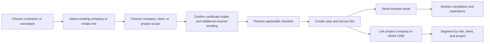

# Consultant and Contractor Onboarding Plan

## Product outcome

ProjOS will provide one reusable qualification repository with two deliberately different, passwordless experiences:

- **Contractor onboarding** for trade contractors, subcontractors, and field service vendors.
- **Consultant onboarding** for architects, engineers, surveyors, inspectors, environmental professionals, and other professional service firms.

An administrator chooses the engagement type, scope, client or project, recipient, and insurance wording once. ProjOS creates the correct checklist, sends a secure magic link, monitors expirations, preserves the evidence history, and links a project-scoped company to APAS CRM with deterministic project and role tags.

## Experience principles

1. No username or password for an invited external company.
2. One clear choice at intake: contractor or consultant.
3. Only applicable requirements appear. Contractors do not see professional-services questions. Consultants do not see field-only safety or commercial-auto requirements unless an administrator adds them.
4. Insurance instructions are visible before upload and travel with the qualification case.
5. The company profile is reusable. Qualification decisions remain specific to the workspace, client, or project.
6. CRM synchronization is additive and auditable. Failure never destroys or rolls back a valid onboarding case.
7. AI may extract document facts for human review, but it does not approve insurance, licensing, or readiness.

## Administrator workflow

The project or client selection pre-fills the insured organization name and address when available. The administrator may edit the wording before issuing the invitation.

## External experience

The external portal uses the invitation token as a scoped capability. It shows:

- the engagement type and project or client reference;
- certificate holder, additional insured, and special insurance instructions;
- company profile fields with service-specific language;
- a mandatory checklist separated from optional information;
- upload, written response, acknowledgement, clarification, save, and submission controls;
- progress and human review status.

Contractor defaults include W-9, applicable trade license, general liability, workers compensation or exemption, commercial auto, safety information, experience, and standards acknowledgement.

Consultant defaults include W-9, applicable professional or business license, general liability, workers compensation or exemption, professional liability, relevant professional experience, and standards acknowledgement.

## Data and security changes

- Add `engagement_type` to each qualification case. Existing cases remain contractors.
- Add case-scoped certificate holder, address, additional insured, and insurance instruction fields.
- Add requirement applicability (`contractor`, `consultant`, or `both`) to templates and snapshots.
- Keep the private storage path and token hash controls unchanged.
- Preserve row-level authorization, scope integrity, expiration monitoring, document versioning, and activity logging.
- Never send policy documents, tax identifiers, or raw uploaded evidence to APAS CRM.

## APAS CRM contract

For project-scoped onboarding, the existing server-side APAS CRM gateway accepts either a vendor assignment or a readiness project assignment. It sends the canonical company/contact fields and these controlled tags:

- `ProjOS Onboarding`
- `Contractor` or `Consultant`
- `Client: <client name>` when available
- `Project: <project name>`

The CRM remains the master identity system. ProjOS remains the authority for project relationship, qualification evidence, readiness state, and gates. A failed or unavailable CRM call is shown as pending follow-up and does not block the secure onboarding invitation.

## Verification

- Unit tests verify the engagement and insurance context sent to the database.
- Unit tests verify project-scoped CRM synchronization and safe failure behavior.
- Source contract tests verify role-specific CRM tags and readiness assignment support.
- Database tests verify consultant-specific requirement snapshots and insurance context persistence.
- Production verification must test one controlled contractor link and one controlled consultant link on mobile and desktop, then confirm APAS CRM segmentation by project and role.

## Deployment sequence

1. Merge migration and application changes together.
2. Run typecheck, unit tests, production build, targeted browser tests, and Supabase SQL tests.
3. Deploy the migration before or with the updated edge functions.
4. Deploy `contractor-invite`, `contractor-portal`, and `crm-integration-gateway`.
5. Verify email delivery, token expiry, document upload, consultant professional-liability request, and APAS CRM tags.
6. Enable enforcement gates only after existing active companies have current qualification cases.

