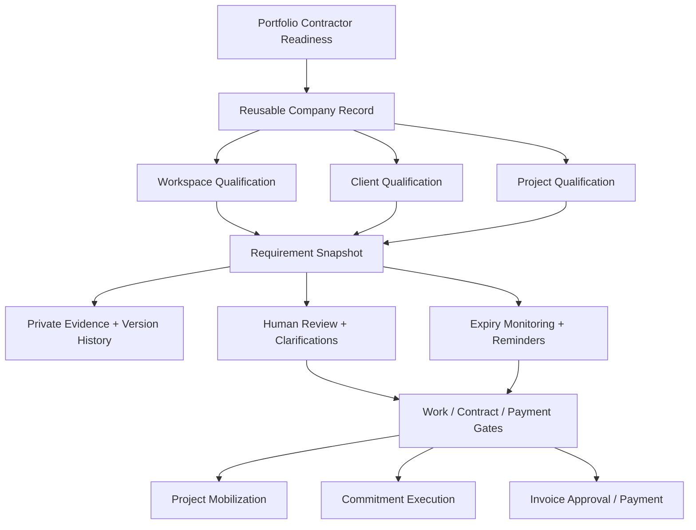
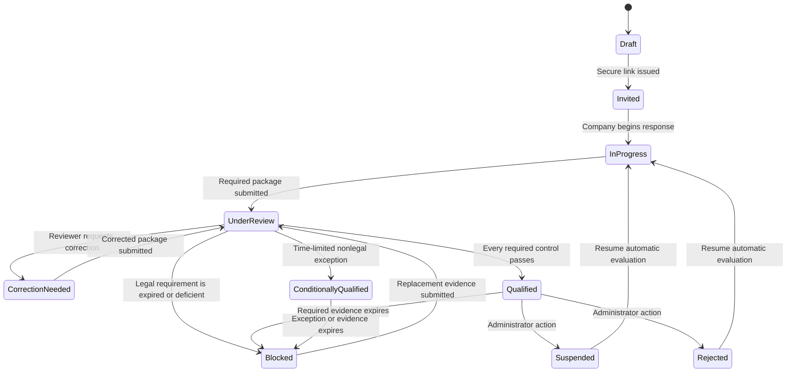

# projOS Contractor Readiness

## Product decision

Contractor Readiness is a paid, workspace-gated projOS module for screening and continuously monitoring subcontractors, consultants, trades, and service vendors. It is intentionally not a public marketplace. The product answers a narrower and more valuable operating question:

> Is this company qualified, current, and authorized to contract, mobilize, and receive payment for this client and project today?

The system maintains one reusable company record while preserving client- and project-specific qualification decisions. A contractor can therefore be qualified company-wide, subject to additional requirements for an individual client, or separately qualified for a high-risk project.

## Outcomes

- Replace email-based W-9, license, insurance, safety, and experience collection with one secure checklist.
- Give workspace, client, and project administrators a consistent review process.
- Keep expiring credentials current with automatic reminders.
- Stop work, contract execution, or payment approval when an enabled deterministic gate fails.
- Preserve every replaced document, review decision, exception, and status change in an audit trail.
- Let contractors and insurance brokers respond without creating a projOS account.
- Use AI only to extract visible document fields and review flags; a human makes every qualification decision.
- Package the capability as an optional, separately monetizable module.

## Users and permissions

| User | Scope | Main capabilities |
|---|---|---|
| Workspace administrator / owner | Workspace | Enable module, configure standard policy, manage all cases, enforce gates |
| Client administrator | Assigned client | Create and manage client/project qualification cases inside that client |
| Project manager | Assigned project | Create and review project qualification cases |
| Reviewer | Granted project/client | Review evidence, ask questions, verify or request corrections |
| Contractor representative | One token-scoped case | Maintain company information, experience, upload evidence, comment, submit |
| Insurance broker | One token-scoped case | Upload requested evidence and answer questions only |
| Viewer/client portal user | None by default | No access to private qualification documents unless explicitly added later |

The database row-level policies are authoritative. Navigation visibility is a convenience, not the security boundary.

## Information architecture

## Entry points

- Desktop navigation: **People → Contractor Readiness**
- Mobile navigation: **More → Organization → Contractor Readiness**
- Client record: **Organizations → Client → Contractors**
- Project navigation: **Project → Contractors**
- Vendor commitment: readiness summary and direct link on the commitment detail page
- External intake: `/contractor/onboard/:token`

## Core workflow

Qualification states are computed from checklist evidence except for explicit suspension or rejection. The user interface does not allow an administrator to manually mark an incomplete company “qualified.”

## Standard checklist

The initial workspace template includes:

1. Current Form W-9 — payment gate
2. Applicable trade license — work gate; legally required; no waiver
3. General liability insurance — work gate; expiration required
4. Workers compensation coverage or valid exemption — work gate; expiration required
5. Commercial auto insurance — work gate; expiration required
6. Safety program or recent safety record — contract gate
7. Relevant project experience and references — contract gate
8. Vendor standards acknowledgement — contract gate

Workspace administrators can add requirements, mark them required, and assign a gate. Template edits apply to future cases; an existing case retains its historical checklist snapshot.

## Deterministic gates

The module evaluates three cumulative gates:

| Gate | Required evidence | Enforcement point |
|---|---|---|
| Work | Required work items | Project assignment cannot become active |
| Contract | Work + contract items | Commitment cannot become executed |
| Payment | Work + contract + payment items | Commitment invoice cannot become approved or paid |

Each gate is independently enabled in module policy. If an enabled gate has no applicable qualification case, the operation is blocked. The most specific available case and policy wins in this order: project, client, workspace.

Readiness score is a transparent weighted completion indicator, not the gate itself. Legally required items carry weight 3; other work-gate items carry weight 2; remaining required items carry weight 1. A high score never overrides a failed gate.

## Exceptions

- Legally required checklist items cannot be waived or given a temporary exception.
- A nonlegal item may receive a documented, time-limited exception from an authorized manager.
- The reason, approver, approval time, and expiration are stored.
- An active exception can clear its configured gate, but the overall case remains **Conditionally qualified**.
- Expired or revoked exceptions stop satisfying the gate.

## Contractor and broker experience

The external portal is branded, responsive, and passwordless. A 256-bit random token is generated for each invitation. Only its SHA-256 hash is stored. Links expire after 30 days and may be revoked.

Contractors can:

- confirm legal company and contact information;
- describe trades, service areas, staffing, and company background;
- add representative projects and references;
- upload PDF, DOCX, JPG, PNG, or WebP evidence up to 15 MB;
- capture supporting images directly from a phone;
- supply issue date, expiration date, identifier, and issuing authority;
- replace a file while preserving the prior version;
- ask and answer questions per checklist item;
- save progress and submit the complete package.

Broker links are intentionally narrower: they may upload evidence and answer questions, but cannot alter the contractor's company profile, experience record, or submit the entire package.

## Document control

- Storage bucket is private.
- File paths are scoped by workspace, organization, qualification case, and requirement.
- Staff storage access is limited to an authorized workspace/client/project manager.
- External uploads use signed, non-upsert upload URLs minted by the token-validating edge function.
- Replacement evidence marks the prior record superseded rather than deleting it.
- Verified evidence becomes expired automatically after its expiration date.
- Document metadata and review status are separate from AI extraction.

## AI boundaries

The document assistant receives only the uploaded document and verified database metadata for the company and expected document type. It may extract visible fields, identify contradictions, and flag unreadable or missing information. It may not:

- use the public web or outside data;
- approve, reject, verify, or qualify a company;
- make a legal or licensing conclusion;
- invent a missing value;
- modify a gate directly.

Every AI response is stored as a draft with confidence and a `requires_human_review` marker. The reviewer must open the source evidence and make the final decision.

## Automated monitoring

A daily scheduled job:

1. marks verified documents expired when their expiration date has passed;
2. recomputes every affected qualification case;
3. sends date-based reminders at 90, 60, 30, 7, and 0 days;
4. sends weekly reminders for requested missing items;
5. sends correction and expired-item notices;
6. generates a new secure link for the notification;
7. deduplicates each reminder in an immutable delivery log.

## Data isolation and audit controls

- Every core row carries a workspace identifier.
- Scope-integrity triggers reject cross-workspace company, client, project, document, and assignment relationships.
- Case access derives from workspace administration, project permission, or client administration.
- Public clients never query qualification tables directly.
- Sensitive token values are never stored; only hashes are retained.
- Internal notes are excluded from all contractor portal responses.
- Activity logs record qualification creation, invitations, company updates, uploads, submissions, and status transitions without copying document contents.

## Commercial packaging

`contractorReadinessEnabled` is an opt-in workspace module behind the platform entitlement `platform_contractor_readiness`. It is included in the Enterprise and Construction Nspire bundles and can also be sold as a standalone add-on. Disabling the workspace module hides the feature and makes enforcement gates fail open so an unpurchased module cannot break the customer's existing operation.

## Acceptance criteria

- An authorized administrator can create a qualification at workspace, client, or project scope.
- An unauthorized user cannot see or mutate a case or its private files.
- A contractor can complete the workflow from a mobile device without an account.
- A broker link cannot change company or portfolio information.
- A reviewer can verify, reject, request correction, mark a nonlegal item not applicable, or issue a time-limited exception.
- A legal item cannot be waived by the UI or database.
- Qualification status and gate booleans recompute whenever requirement or exception state changes.
- An enabled gate blocks the corresponding operation at the database level.
- A replacement document preserves the prior evidence record.
- Expired evidence automatically changes readiness and produces a reminder.
- AI output cannot independently alter verification or qualification.
- Navigation and layouts work consistently on desktop, tablet, and phone.

## Future extensions

These are intentionally outside the first production release and can be layered onto the current schema:

- third-party license registry and sanctions checks;
- configurable coverage thresholds by trade/risk tier;
- reference-call workflow and scored reference forms;
- bid invitation sourcing from the qualified internal network;
- diversity/business certification tracking;
- incident-rate calculations and safety prequalification scoring;
- vendor self-service user accounts in addition to magic links;
- aggregate benchmarking with privacy-safe, tenant-consented data.

