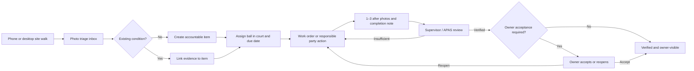

# ProjOS Field Accountability — Product Requirements and Build Prompt

## Product intent

Build one reusable, tenant-safe **Field Accountability** module for every construction, consulting, inspection, and property-management project in ProjOS. The client-facing name is **Site Accountability**.

The module turns recurring site photographs into an evidence-backed operating record. It must answer, at a glance:

- What condition was observed?
- Where and when was it observed, and by whom?
- Who has the ball now?
- What action is due, and is it late or recurring?
- What before, progress, and after evidence exists?
- Who verified the work, and does the owner accept it?

The system must never equate “a photo was uploaded” with “the work is complete.” A condition closes only after the configured human review path is satisfied.

## Users and value

### Owner or client

Receives a focused, branded, mobile-first portal. The owner sees completed work first, open obligations, overdue/repeat conditions, evidence awaiting review, decisions/questions requiring an owner response, and a “since your last visit” digest. The owner may ask a question on an item or photograph, accept work that requires owner acceptance, or reopen it with a reason.

### APAS inspector or consultant

Starts a site walk on a phone, takes or selects many photos, preserves capture date and GPS when available, speaks field notes, asks AI to polish those notes without changing facts, triages observations, assigns responsibility, and reviews completion evidence.

### Property manager or maintenance supervisor

Runs proactive daily or scheduled walks, converts observations into assignments, supplies progress and after photographs, answers questions in context, and verifies crew work before it reaches the owner.

### Crew member or vendor

Sees only assigned work through the appropriate project/operations experience, provides one to three after photographs, explains what was done, and submits the item for review.

## Canonical workflow

All paths converge on the same item. Inspections, owner walks, daily logs, grounds observations, work orders, gallery photos, project correspondence, and client updates must link to it rather than creating competing copies.

## Information model

### Site walk

- Tenant, project, optional property
- Visit type: owner walk, APAS inspection, property-manager walk, maintenance walk, crew update, or other
- Visit date/time, title, author, notes, status
- Any number of photos may be captured into its triage inbox

### Accountability item

- Human-readable item number, title, factual description
- Project/property/visit
- Category, severity, location label, optional coordinates
- Status and ball-in-court
- Responsible user/contact/organization
- Due date, repeat count, owner-visible flag, owner-acceptance flag
- Optional work-order and source-module/source-record links
- Ready-for-review, verified, reopened, and archived timestamps

### Photo evidence

- Reuses the private project photo library and its EXIF/GPS metadata
- Links to a walk and optionally an accountability item
- Evidence type: observation, before, progress, or after
- One to three “after” photographs per item; at least one is required before review
- Three may be required by policy for critical/life-safety conditions
- AI suggestions are advisory metadata, never undisclosed facts

### Annotation and conversation

- Normalized x/y pins remain correctly positioned at every screen size
- Each pin has a label and may anchor a question or comment thread
- Comments are either client-visible or internal
- Every status transition is appended to a non-editable event timeline

## Status model

| Status | Meaning | Typical ball in court |
|---|---|---|
| Needs triage | Photograph or condition needs classification | APAS / property management |
| Assigned | Responsibility and due date set | Maintenance / vendor |
| In progress | Work acknowledged or underway | Maintenance / vendor |
| Ready for review | After evidence and completion note submitted | Supervisor / APAS |
| Verified | Required reviewer accepted the evidence | Owner can see/reopen |
| Reopened | Reviewer found the result insufficient | Responsible party |
| Deferred | Intentionally postponed with a documented reason | Named decision-maker |
| Rejected | Not actionable/duplicate, with a reason | Closed record, still auditable |

Completed/verified items appear first in the owner portal because they are the clearest proof of progress. Open views may still be filtered by urgency or due date.

## Verification rules

- Routine: property manager or APAS verifies; owner can see and reopen.
- Significant: supervisor plus property manager/APAS verification.
- Critical, repeat, or owner-originated: owner acceptance is required.
- `Ready for review` requires at least one after photograph.
- An owner or reviewer reopening an item must provide a reason.
- AI may recommend category, severity, duplicate/repeat matches, caption wording, and evidence sufficiency. AI may not assign final liability, fabricate location/date/work performed, or execute a status transition.

## Mobile capture UX

The primary mobile action is **Start site walk**. It opens a bottom-sheet style workflow with large touch targets:

1. Choose walk type and title.
2. Tap **Camera** to use the rear phone camera or **Photo library** to select many images.
3. Preserve EXIF capture time and GPS. If absent, offer explicit “Use current location”; never imply that an inferred location is verified.
4. Show a resilient upload queue with preview, progress, retry, and per-photo caption.
5. Let the user dictate the walk narrative or caption. Browser/OS speech input and Wispr Flow work naturally; ProjOS also provides its existing voice-dictation control.
6. **Polish with AI** fixes clarity and grammar but preserves every fact. The original text remains available in audit metadata.
7. Uploaded photos land in a triage inbox. The user may turn a photo into a new item, group it with others, or attach it to an existing item.

Offline capture is a progressive enhancement: queue safely on the device and upload when connectivity returns. Never show “uploaded” until the server confirms storage and database linkage.

## Desktop and staff UX

The project navigation includes **Field Accountability** under Field/Delivery for all project types by default. The page provides:

- A calm summary band: pending, in progress, ready for review, verified, overdue, repeats, owner response.
- A board/list toggle with search and filters for status, category, location, assignee, ball-in-court, visit, and date.
- A separate **Walk inbox** for untriaged photographs.
- A right-side detail sheet on desktop and full-screen detail on mobile.
- Evidence lanes for Observation/Before, Progress, and After.
- Expandable photographs with pins, metadata, linked record, and comments.
- One-tap, permission-aware transitions with a reason required where appropriate.

## Owner portal UX

The dedicated portal adds **Site Accountability** to the project navigation. It must not expose internal ProjOS navigation or records marked internal.

The page hierarchy is:

1. “Since your last visit” verified completions and material changes.
2. Counts for pending, verified, waiting on owner, overdue, and repeat conditions.
3. A proof-of-progress gallery with before/after evidence.
4. An obligations list showing ball-in-court and due date in plain language.
5. Owner decisions/questions.

Client-visible facts and AI interpretation are visually distinct. Owner actions use plain verbs: **Accept work**, **Ask a question**, **Reopen with reason**.

## AI contract

### Field-photo assistant prompt

> You are the ProjOS Field Photo Assistant. Analyze only the supplied project photograph, its verified EXIF/GPS metadata, the user’s dictated note, and records explicitly provided from this tenant and project. Never use facts from another tenant, project, or outside source. Return advisory suggestions as strict JSON: a concise factual caption, category, severity suggestion, visible location clues, possible duplicate/repeat candidates from the supplied candidate list, clarification questions, and an evidence-sufficiency warning. Distinguish what is visibly observed from what is inferred. Never state that work was completed, code compliant, safe, or accepted. Never invent a date, address, person, unit, asset, cause, measurement, or responsible party. If uncertain, say so and ask a focused question. Preserve the user’s original note. A human must approve every suggestion before it becomes a project record.

### Text-polish prompt

> Rewrite the supplied field note into a short, professional, factual site-photo caption. Preserve every person, place, date, number, uncertainty, and stated condition. Do not add a cause, remedy, responsibility, completion claim, code conclusion, or new observation. Use direct language suitable for an auditable owner report. Output only the polished caption.

## Accessibility, quality, and safety

- WCAG AA contrast, visible focus, keyboard operability, 44 px mobile targets, semantic labels, and reduced-motion support.
- Responsive images use thumbnails and signed URLs; original files open only on demand.
- Tenant isolation is enforced by RLS and owner access by `owner_can_access_project`, never only by client filters.
- Private project-photo storage supports tenant/portal reads and main-portal writes; public URLs are never persisted.
- The event history is append-only.
- Destructive actions archive rather than erase evidence.
- Existing accounting, financial, inspection, and work-order calculations are not changed.

## Acceptance criteria

1. A signed-in staff user can start a walk on a phone, use the camera or multi-select, add voice/typed notes, capture or preserve location, and upload successfully.
2. Every uploaded walk photo is visible in the triage inbox and private project photo library.
3. Staff can create an item, attach photos, assign ball-in-court/due date, and add one to three after photos.
4. `Ready for review` is blocked without at least one after photo.
5. Staff and clients can expand photos, place/read annotation pins, and converse in context according to visibility.
6. A verified item and its before/after evidence appears at the top of the owner portal.
7. An owner can accept an owner-required item or reopen it with a reason; both actions are audited.
8. A user from another tenant or an owner without access to the project cannot read records or storage objects.
9. The module appears consistently for consulting and construction projects and in the client portal when enabled.
10. Automated tests cover status validation, evidence limits, owner RLS, tenant boundaries, and module navigation.
