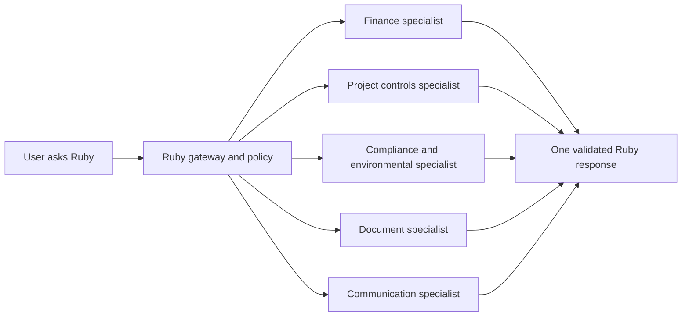
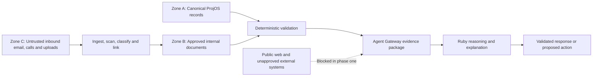
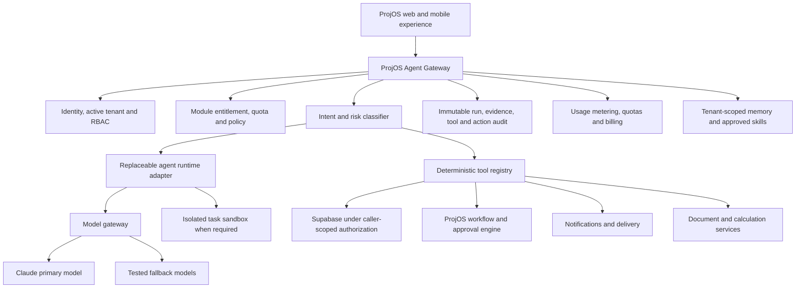
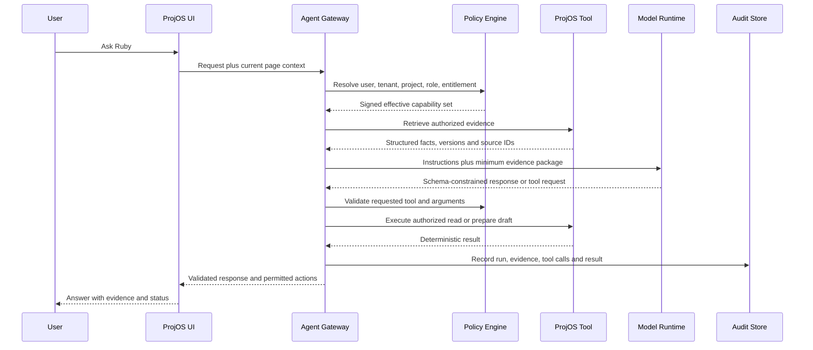
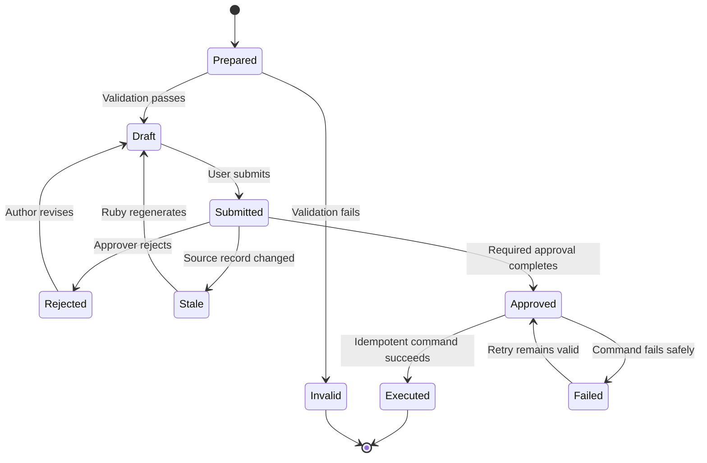
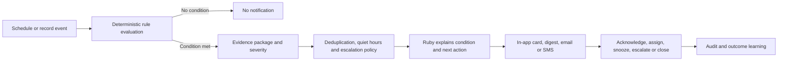
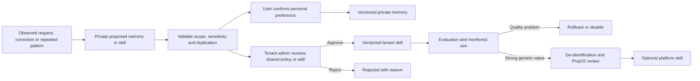

# Product Requirements Document: Ruby Intelligence Module

**Product:** ProjOS  
**Working product name:** Ruby  
**Document status:** Draft for founder review and product sparring  
**Document type:** Product requirements and target architecture; not an implementation plan  
**Last updated:** August 19, 2026  
**Proposed owner:** APAS / ProjOS Product  
**Delivery model:** Optional, paid, tenant-enabled module  

---

## 1. Purpose of this document

This PRD defines how ProjOS should add a governed intelligence and agentic-operations layer on top of the application without replacing ProjOS as the system of record and without allowing a model to bypass established financial, contractual, compliance, or approval controls.

The module is intended to add measurable value to:

- The tenant company operating ProjOS.
- The tenant's CEO, executives, administrators, project managers, finance team, field team, inspectors, and other authorized users.
- Authorized client, owner, consultant, vendor, or subcontractor portal users, with information limited to their existing access.
- APAS as the platform operator, through controlled product analytics, support tooling, and module monetization.

This document is deliberately detailed so that the product behavior, trust boundaries, commercial model, and user experience can be debated and finalized before converting the approved requirements into `plan.md` and beginning implementation.

---

## 2. Executive product decision

ProjOS should introduce a customer-facing optional module called **Ruby**. Ruby should be presented as a native ProjOS capability, not as a separate Hermes, Claude, or Vercel product.

Ruby will:

1. Answer questions using authorized ProjOS data.
2. Explain project, financial, operational, environmental, regulatory, safety, and compliance conditions.
3. Produce evidence-linked briefings, updates, reports, drafts, and recommendations.
4. Prepare structured actions such as invoices, proposals, change orders, work orders, correspondence, meeting updates, and follow-ups.
5. Route consequential actions through the same deterministic ProjOS workflows and approvals already used by human users.
6. Monitor deterministic conditions and deliver timely, role-appropriate updates.
7. Learn controlled preferences, approved tenant policies, and repeatable workflows without sharing tenant information across customers.
8. Explain what Ruby can do and recommend relevant capabilities when a user's work pattern indicates an opportunity.

Ruby will not:

- Become a second system of record.
- Perform financial calculations by improvising in a language model.
- Browse the public internet in the initial release.
- Treat an uploaded document, email, transcript, or web page as an instruction to the agent.
- Execute payments, contract commitments, external communications, or other consequential actions without the required human authorization.
- Receive a global service-role credential that bypasses tenant security.
- Learn from one tenant and expose that information to another tenant.
- Require clients to install, configure, patch, or maintain Hermes or any other agent runtime.

### 2.1 Recommended technical direction

- Keep ProjOS and Supabase as the permanent identity, authorization, record, workflow, audit, and billing authority.
- Establish a provider-neutral **ProjOS Agent Gateway** as Ruby's only route into application data and actions.
- Use a model-neutral interface, with Claude as the preferred initial reasoning model and tested fallbacks available.
- Pilot Vercel's `eve` as a replaceable orchestration adapter for durable sessions, human approvals, scheduled work, subagents, and sandboxed execution.
- Do not fork Hermes for the customer-facing product. Hermes may remain an internal research or dedicated single-tenant experimentation environment.
- Keep all ProjOS business tools independent of the chosen model and agent runtime so either can be changed later.

---

## 3. Product thesis

ProjOS already contains the project facts, financial ledgers, documents, workflows, contacts, commitments, inspections, risks, permits, reports, correspondence, and action history required to manage work. The principal value of Ruby is not creating another chatbot. The value is turning those records into timely understanding and controlled execution.

Ruby should reduce the distance between:

```text
Something happened
→ the system recorded it
→ the responsible person understood it
→ the correct decision was made
→ the approved action was executed
→ the result was documented
```

The product promise is:

> **Ruby helps every authorized person understand what matters, why it matters, what the evidence says, and what approved action should happen next—without surrendering control of the record or the decision.**

---

## 4. Terminology

| Term | Definition |
|---|---|
| Ruby | Customer-facing name for the optional ProjOS intelligence module. |
| Agent Gateway | Server-side ProjOS boundary that authenticates the user, establishes scope, authorizes tools, validates outputs, records audit events, and meters usage. |
| Agent runtime | Replaceable execution environment that manages model turns, tool calls, durable sessions, schedules, and optional subagents. |
| Model | Foundation model used for language understanding, classification, drafting, and explanation. |
| Deterministic engine | ProjOS code, database view, RPC, rule, or calculator that returns reproducible results from defined inputs. |
| Tool | A narrowly defined ProjOS operation Ruby may request, such as `get_invoice_basis` or `draft_change_order`. |
| Evidence | A ProjOS record, approved internal document, or governed inbound artifact supporting a statement. |
| Proposed action | A fully specified action prepared by Ruby but not yet executed. |
| Consequential action | An operation that changes a record, changes money, creates an obligation, sends information externally, changes access, or changes workflow state. |
| Memory | Governed information Ruby may reuse, separate from transactional project truth. |
| Skill | A versioned procedure describing how Ruby should perform a repeatable task with approved tools. |
| Tenant | A ProjOS workspace/company boundary. |
| Active workspace | The explicitly selected tenant context in which the user is operating. |

---

## 5. Product principles

### 5.1 ProjOS is the authority

If model prose conflicts with a ProjOS record or deterministic calculation, the ProjOS record and calculation prevail. Ruby never becomes an alternate ledger.

### 5.2 Evidence before eloquence

Ruby must prefer an incomplete but verifiable answer over a polished unsupported answer. Material facts must be traceable to source records.

### 5.3 Deterministic facts and actions; flexible language

A language model is probabilistic. Ruby cannot promise identical wording on every run. Ruby can and must promise that:

- Material numbers come from deterministic tools.
- Material statuses come from current authorized records.
- Calculations are performed by versioned ProjOS logic.
- Proposed actions have explicit inputs and validation.
- Executed actions use idempotent application commands.
- The final answer discloses missing or conflicting information.

The required standard is **deterministic business truth**, not word-for-word deterministic prose.

### 5.4 The agent cannot exceed the user

Ruby inherits the user's tenant, project, role, audience, and record-level permissions. Ruby cannot see or do anything the signed-in user could not legitimately see or do through the application.

### 5.5 No silent consequential action

Ruby may read, analyze, draft, and recommend within policy. Any action affecting money, obligations, status, external communication, access, or official records must pass through a review and approval policy.

### 5.6 Autonomy is earned by workflow

Autonomy is granted per tool and action class, not globally. Low-risk actions may be automated after testing. Higher-risk actions remain approval-gated.

### 5.7 Tenant learning stays in the tenant

No memory, prompt, example, document, output, or learned procedure moves from one tenant to another without an explicit, reviewed, de-identified platform publication process.

### 5.8 One simple client experience

Customers should not manage agent infrastructure. They should see Ruby inside ProjOS, using their existing login, roles, projects, notifications, and workflows.

### 5.9 Existing application logic is reused

Ruby calls the same canonical financial, workflow, notification, document, and approval logic used by the application. It does not reimplement critical logic inside prompts.

---

## 6. Goals and non-goals

### 6.1 Product goals

1. Give every authorized user a role-specific operational intelligence partner.
2. Reduce time spent finding, reconciling, summarizing, and explaining project information.
3. Improve the timeliness and completeness of required follow-up.
4. Make financial and contractual information easier to understand without weakening controls.
5. Prepare high-quality, reviewable business artifacts faster.
6. Convert calls, messages, documents, and meetings into governed ProjOS records and proposed actions.
7. Identify emerging risks through deterministic rules and explain their significance.
8. Provide controlled self-learning that becomes more useful to a tenant over time.
9. Monetize Ruby as an optional module with transparent usage and value reporting.
10. Preserve provider and runtime portability.

### 6.2 Non-goals for initial releases

- Unrestricted public-web research.
- Autonomous payment release.
- Autonomous contract execution.
- Autonomous sending of consequential client or regulatory correspondence.
- A general-purpose coding agent exposed to customer users.
- Model fine-tuning directly on raw tenant data.
- Cross-tenant benchmarking using identifiable customer information.
- Replacing human professional judgment in engineering, surveying, legal, accounting, environmental, safety, or regulatory matters.
- Replacing the ProjOS workflow engine.
- Moving the existing ProjOS frontend or all backend functions to a new hosting provider.

---

## 7. Target users and value by role

| User | Primary questions | Ruby value |
|---|---|---|
| CEO / executive | What needs attention? Where are money and risk moving? What decisions are mine? | Executive briefing, portfolio exceptions, exposure, cash and contract summaries, decision queue. |
| Tenant administrator | Is the organization using ProjOS correctly? What controls or automations should be enabled? | Adoption coaching, policy management, skill approval, usage and value reporting. |
| Project executive | Which projects are off plan? What is unresolved? | Cross-project health, high-value change exposure, aging items, owner decisions. |
| Project manager | What must I do today? What is blocking progress? | Daily briefing, ball-in-court queue, draft communications, meeting and follow-up preparation. |
| Finance / controller | What is billable, payable, retained, unallocated, inconsistent, or awaiting approval? | Evidence-linked financial analysis, invoice preparation, reconciliation, exception detection. |
| Field superintendent | What work, inspection, delivery, safety, or documentation issue requires action? | Voice-friendly updates, work-order and daily-report preparation, alerts and checklists. |
| Inspector / compliance user | What is due, deficient, missing, or awaiting closeout? | Permit and inspection summaries, corrective-action drafts, evidence packages. |
| Client / owner | What is the approved status of my project and what decision is required from me? | Owner-safe summaries, approval queue, progress updates, contract/pay-app/change-order explanation. |
| Consultant | What deliverables, meetings, invoices, and client actions are outstanding? | Scope tracking, proposal/invoice drafts, action register, client update preparation. |
| Vendor / subcontractor | What is required from my company, and what is the status of my contract, submission, invoice, or payment? | Restricted self-service answers, missing-document guidance, submission assistance. |
| APAS platform operator | Is Ruby healthy, safe, useful, and commercially sustainable? | Usage, quality, safety, tenant health, support diagnostics, cost and margin reporting. |

---

## 8. Customer-facing experience

### 8.1 Primary entry points

Ruby should appear as a native capability in four places:

1. **Global Ask Ruby button** in the signed-in application header.
2. **Contextual Ruby action** on supported records and pages.
3. **Ruby Briefing** card on Dashboard, My Day, and Cockpit.
4. **Ruby Approval Center** containing proposed actions awaiting review.

Ruby should not add a second large navigation system. The main interaction begins with a compact panel or command surface and expands only when the task requires evidence, editing, or approval.

### 8.2 Context header

Every Ruby interaction displays the effective context before the user submits:

```text
Ruby
R4 Capital LLC  ·  Glorieta Gardens Sewer Extension  ·  Project Manager view
Internal ProjOS data only  ·  As of 9:42 AM
```

If the user belongs to multiple tenants, active workspace selection is mandatory. Ruby must never silently select the first available membership.

### 8.3 Core interaction modes

| Mode | Purpose | Example |
|---|---|---|
| Ask | Answer a bounded question from authorized evidence. | “What change orders still need owner approval?” |
| Explain | Explain a record, calculation, condition, or variance. | “Why did remaining contract value change?” |
| Prepare | Produce a draft artifact or proposed action. | “Prepare the August owner invoice.” |
| Review | Check a draft or record against rules and evidence. | “Review this pay application for inconsistencies.” |
| Monitor | Watch deterministic conditions and notify the right person. | “Notify me if a permit is within 30 days of expiration.” |
| Brief | Produce a role-appropriate summary on a schedule or on demand. | “Give me my morning executive briefing.” |
| Teach | Explain a ProjOS feature and offer to help use it. | “How should I manage this through the change-order workflow?” |

### 8.4 Trust strip on every material answer

Every answer containing project facts should show:

- Scope: tenant and project.
- Data timestamp or “as of” time.
- Evidence count and direct links.
- Verification status: Verified, Partially Verified, or Insufficient Data.
- Any missing, stale, or conflicting information.
- Whether the response is informational, a draft, or an executable proposal.

### 8.5 Approval experience

When Ruby prepares an action, the user sees a review card containing:

- Action name.
- Target record or recipient.
- Exact fields or content that will change.
- Financial and workflow effect.
- Source evidence.
- Required approver and current ball-in-court.
- Warnings or missing prerequisites.
- Buttons appropriate to policy: Edit, Reject, Save Draft, Submit for Approval, Approve and Execute.

The UI must never use a conversational “yes” as sufficient authorization for a high-risk action. Approval must occur through a typed, policy-aware application control.

### 8.6 Running work and progress updates

Ruby must make long-running work visible rather than leaving the user inside an indefinite chat spinner. Every durable task should have a compact activity card with these defined states:

```text
Queued
→ Establishing scope
→ Gathering evidence
→ Validating records
→ Preparing result
→ Waiting for input or approval
→ Executing approved action
→ Completed, blocked, failed, or canceled
```

The activity card should show:

- What Ruby is doing in plain language.
- Which tenant and project the work belongs to.
- Start time and most recent progress time.
- Whether Ruby is waiting for a person, a record, or a system.
- Safe controls to open, pause, cancel, resume, or dismiss the work.
- A final link to the answer, artifact, proposed action, or audit record.

Ruby should notify the requesting user when background work completes or requires a decision. A tenant administrator may view tenant-shared operational runs but does not automatically receive access to another user's private conversation content.

---

## 9. Proposed product name and naming system

### 9.1 Recommended name

**Ruby** is the recommended customer-facing name.

Recommended descriptor:

> **Ruby — Project intelligence, grounded in your records.**

Recommended interaction labels:

- Ask Ruby
- Ruby Briefing
- Ruby Review
- Ruby Watch
- Ruby Draft
- Ruby Approval Center
- Ruby Memory
- Ruby Skills
- Ruby Admin

“Hermes,” “Claude,” “eve,” and model names should remain implementation details and should not appear as primary customer branding.

### 9.2 Alternative names for consideration

| Name | Strength | Concern |
|---|---|---|
| Ruby | Personal, memorable, usable everywhere, already preferred by the founder | Needs a clear descriptor to communicate enterprise value. |
| Ruby Intelligence | More explicit enterprise positioning | Slightly longer. |
| Ruby Command | Strong operations connotation | Could sound overly autonomous. |
| Ruby Project Intelligence | Very clear | Less conversational. |
| Beacon | Communicates guidance and risk awareness | Less ownable and less personal. |
| Guardian Intelligence | Aligns with oversight and protection | Can sound surveillance-oriented. |
| ProjOS Intelligence | Clear product relationship | Less human and less memorable. |

### 9.3 Naming decision requested

Unless changed during PRD review, the implementation plan should use **Ruby** as the feature name and **ProjOS Intelligence Module** as the commercial/category name.

---

## 10. Capability map

### 10.1 Core capability families

| Capability family | Functions |
|---|---|
| Contextual intelligence | Ask questions, explain records, summarize pages, compare versions, identify missing data. |
| Executive intelligence | Portfolio briefing, project exceptions, decisions due, financial exposure, compliance posture. |
| Project operations | My Day briefing, ball-in-court, RFIs, submittals, meetings, daily reports, punch, schedule, work orders. |
| Financial control | Contract, change-order, pay-app, invoice, payment, retainage, commitment, allocation, and reconciliation analysis. |
| Document intelligence | Extract, classify, compare, summarize, cite, and prepare governed artifacts. |
| Communications | Draft updates, emails, meeting follow-ups, notices, and correspondence from system evidence. |
| Voice and intake | Turn approved phone-call or voice intake into logs, tickets, proposed work orders, and follow-ups. |
| Risk and compliance | Explain deterministic alerts for permits, inspections, safety, environmental obligations, deadlines, and documentation gaps. |
| Action preparation | Prepare structured proposals, change orders, invoices, work orders, tasks, and workflow updates. |
| Proactive monitoring | Scheduled briefings, exception detection, escalation, reminder suppression, and digest delivery. |
| Controlled learning | User preferences, approved tenant policies, reusable skills, feedback, and workflow recommendations. |
| Product coaching | Explain available ProjOS features and suggest relevant capabilities based on authorized usage patterns. |

### 10.2 Initial high-value use cases

The first commercial release should concentrate on workflows with high value, strong data availability, and clear verification:

1. Morning project and executive briefing.
2. Project question answering with evidence links.
3. Financial and contract explanation using deterministic calculations.
4. Invoice preparation and validation.
5. Proposal and change-order drafting using existing records and templates.
6. Meeting/call/email follow-up preparation.
7. Permit, inspection, compliance, and documentation alerts.
8. Ball-in-court and overdue-action summaries.
9. Approved client update preparation.
10. ProjOS capability coaching.

### 10.3 One Ruby experience with specialist capabilities

Customers should interact with one consistent Ruby identity. Internally, the gateway may delegate a bounded part of a task to specialist workers, skills, or subagents. Specialization is an implementation technique, not a collection of confusing customer-facing bots.



Each specialist receives only the minimum evidence and tools required for its assignment. A specialist cannot expand the user's authority, communicate externally, or execute a consequential action independently. Ruby presents one consolidated result with one evidence trail and one approval path.

Illustrative specialist responsibilities:

| Specialist capability | Responsible work | Explicit limitation |
|---|---|---|
| Finance | Reconciliation, invoice basis, contract and payment analysis | Uses canonical calculators; cannot release payment. |
| Project controls | RFIs, submittals, changes, schedule, meetings, ball-in-court | Cannot alter approval or execution state without workflow authorization. |
| Compliance | Permits, inspections, environmental obligations, documentation gaps | Reports stored requirements; does not invent legal requirements. |
| Documents | Extraction, comparison, template population, final artifact assembly | Inbound text is evidence, not instruction. |
| Communications | Draft client updates, emails, notices, and follow-ups | Cannot send externally without applicable approval. |
| Product coach | Explain available ProjOS capabilities and relevant workflows | Cannot promise undeployed or unentitled functionality. |

---

## 11. Detailed workflow examples

### 11.1 Example A: CEO morning briefing

**User request:** “Ruby, what needs my attention today?”

**System behavior:**

1. Resolve tenant and CEO role from the authenticated session.
2. Run deterministic portfolio tools for overdue decisions, financial exposure, critical alerts, upcoming deadlines, and escalations.
3. Rank conditions using a versioned rule set.
4. Generate a concise explanation based only on returned records.
5. Link each statement to the underlying ProjOS item.
6. Offer permitted follow-up actions.

**Illustrative output:**

> **Three decisions need your attention.**  
> 1. Glorieta PCO-014 has been awaiting owner action for 12 days; current exposure is **$48,250.00**.  
> 2. Larkin proposal 007 cannot be executed because the returned signed PDF has not been verified as the final client version.  
> 3. One environmental permit expires in 27 days and has no renewal task assigned.  
>  
> Verified from 7 ProjOS records as of 8:05 AM. No external sources used.

Ruby may explain or prepare follow-up, but it may not approve the PCO, mark the proposal executed, or submit the permit renewal without the required authorized action.

### 11.2 Example B: Generate an invoice

**User request:** “Prepare this month’s invoice for the Larkin consulting project.”

**System behavior:**

1. Identify the active project and authorized billing arrangement.
2. Retrieve contract amount, scope, billing method, prior invoices, approved changes, current period, and supporting deliverables through deterministic tools.
3. Run a canonical invoice-basis calculator.
4. Validate duplicate periods, contract limits, arithmetic, tax/retainage rules, and missing support.
5. Present the basis and any gaps before creating anything.
6. Create a draft invoice only after user confirmation or an approved low-risk policy.
7. Route the draft through the tenant’s invoice approval workflow.
8. Send externally only after the required approval.

**Illustrative review card:**

```text
Proposed invoice: Larkin Hospital — August 2026
Contract basis:          $72,000.00
Previously invoiced:     $36,000.00
Current eligible amount: $ 6,000.00
Remaining after invoice: $30,000.00
Supporting records: 4
Warnings: August client update is still in draft.

[Edit] [Save Draft] [Submit for Approval]
```

Ruby does not perform the arithmetic in prose. The invoice calculator returns the values and validation result; Ruby explains them.

### 11.3 Example C: Financial reconciliation

**User request:** “How much have we paid this subcontractor and what remains?”

**System behavior:**

1. Resolve the specific commitment.
2. Retrieve executed base contract, approved commitment changes, posted payments, allocations, reversals, and retainage.
3. Use one canonical commitment reconciliation function.
4. Return an exact total, an as-of date, and every included transaction ID.
5. Identify unallocated, duplicate, reversed, or unmatched payments.
6. Refuse to fill gaps with an estimate.

**Required response behavior:**

```text
Verified paid to date: $550,479.39 as of August 19, 2026
Included payments: 36
Unallocated payments: 0
Potential duplicates: 0
Remaining authorized value: [deterministic result]
Evidence: commitment ledger, approved change orders, payment allocations
```

If records conflict, Ruby must show the conflicting totals and stop short of declaring reconciliation complete.

### 11.4 Example D: Call to work order

**Event:** A tenant user or caller reports an emergency by phone.

**System behavior:**

1. Record the call metadata and transcript as untrusted inbound content.
2. Extract candidate property, location, caller, condition, urgency, and requested response.
3. Validate the property and caller against ProjOS.
4. Apply deterministic emergency classification rules.
5. Create a proposed work order or maintenance request.
6. Notify the appropriate supervisor based on configured escalation rules.
7. Require approval if cost, vendor dispatch, or external commitment thresholds are met.
8. Preserve transcript-to-record evidence links.

Ruby must not obey instructions embedded in the transcript that attempt to change permissions, disclose unrelated data, or bypass approval.

### 11.5 Example E: Permit and compliance watch

**Scheduled behavior:**

1. A deterministic monitor evaluates permits, obligations, inspections, deliverables, and dates.
2. The rule engine creates an alert only when a versioned condition is satisfied.
3. Ruby explains the condition, consequence, evidence, responsible party, and recommended next step.
4. Notification policy chooses in-app, digest, email, or SMS delivery.
5. Acknowledgment, assignment, escalation, and closure are recorded.

Ruby does not invent regulatory requirements. It reports the requirements stored in approved ProjOS records and documents.

### 11.6 Example F: Capability coaching

**Observed pattern:** A project manager repeatedly copies meeting notes into emails and manually creates action items.

**Ruby response:**

> “ProjOS can generate a reviewed meeting follow-up and proposed action items from the approved meeting record. Would you like to preview that workflow? Nothing will be sent or assigned until you approve it.”

Capability coaching must be relevant, dismissible, and frequency-limited. It must not expose usage information about other users unless the viewer is authorized to see tenant adoption analytics.

### 11.7 Example G: Weekly client update

**User request:** “Prepare this week’s client update for the sewer extension project.”

**Objective:** Turn approved project activity into a clear, evidence-linked weekly client update covering accomplishments, upcoming work, decisions needed, schedule movement, budget status, risks, photos, and responsible parties.

**System behavior:**

1. Resolve the active tenant, project, reporting period, requesting user, client audience, and approval policy.
2. Gather authorized activity from approved daily reports, completed and upcoming schedule activities, meeting actions, RFIs, submittals, inspections, change orders, pay applications, budget records, risk items, correspondence, work orders, and project photos.
3. Exclude drafts, private internal discussions, contractor-only financial information, unapproved change values, and records outside the client’s permitted audience unless an authorized editor deliberately includes and approves them.
4. Build a structured factual evidence package for each update section.
5. Calculate schedule and budget changes using canonical ProjOS tools rather than model arithmetic.
6. Draft a client-readable narrative while preserving a visible distinction between verified facts and Ruby interpretation.
7. Identify missing reporting areas, stale records, unsupported claims, overdue decisions, and unnamed responsible parties.
8. Present a preview with evidence links, selected photos, recipients, delivery channels, and required approvers.
9. Permit an authorized user to edit, return, reject, or submit the update for approval.
10. Block email delivery and portal publication until the required approval is complete.
11. On approval, publish or send through one idempotent command, preserve the exact approved version, and link the delivery receipt and portal record to the audit history.

**Required update structure:**

| Section | Required content | Deterministic or governed basis |
|---|---|---|
| Reporting period | Start date, end date, issue date | User-confirmed period and system clock |
| Executive summary | Concise status narrative | Ruby interpretation based on cited verified facts |
| Accomplishments | Work completed during the period | Approved daily reports, completed activities, inspections, photos, and records |
| Upcoming work | Planned work for the next reporting period | Current approved schedule and assigned work |
| Decisions needed | Decision, responsible party, requested-by date, effect of delay | Open workflow items, meeting actions, RFIs, submittals, and owner actions |
| Schedule movement | Baseline/current dates, movement, milestones, and stated cause | Versioned schedule comparison; interpretation separately labeled |
| Budget status | Approved contract, approved changes, billed/paid status, pending exposure when client-visible | Canonical owner-safe financial tools |
| Risks and mitigations | Verified risk condition, owner, due date, mitigation status | Risk records and deterministic monitors; Ruby may explain significance |
| Photos | Selected image, date, location, caption, source, and visibility | Approved project photo records |
| Responsible parties | Each open commitment or decision and its ball-in-court | Workflow assignment and due-date records |
| Approvals and distribution | Approver, recipients, portal audience, approved version, delivery status | Workflow and communication audit records |

**Verified fact and interpretation presentation:**

The editing and preview experience must distinguish the two content types visually and structurally:

```text
VERIFIED FACT
Manhole MH-06 passed the recorded inspection on August 17, 2026.
Source: Inspection INS-184 · Daily Report 2026-08-17

RUBY INTERPRETATION
This removes the documented inspection hold on the Building 6 connection;
the remaining schedule effect depends on the current crew plan.
Basis: verified inspection result and current schedule records
```

Ruby interpretation must never be presented as a verified fact. An editor may revise an interpretation, but converting it into a verified fact requires supporting evidence.

**Photo controls:**

- Only project photos authorized for the client audience may be selected.
- Each photo must retain its original record ID, capture date, uploader, project/location metadata when available, and approved caption.
- Ruby may propose a caption, but AI-written captions must be marked as draft until reviewed.
- Faces, license plates, sensitive equipment information, private documents, and safety-sensitive imagery must follow the tenant’s privacy and release policy.
- Removing a photo after approval makes the prepared update stale and requires renewed approval.

**Release rule:**

```text
Prepared draft
→ project-manager review
→ required client-update approval
→ immutable approved version
→ email and/or portal release
→ delivery and view audit
```

No draft, preview, or conversational confirmation may bypass this release rule.

---

## 12. Deterministic-response framework

### 12.1 Response classes

Every Ruby request must be classified before execution.

| Class | Examples | Required control |
|---|---|---|
| D1: Exact lookup | Status, date, count, amount, assignee | Deterministic query; templated or schema-constrained response. |
| D2: Exact calculation | Contract balance, retainage, invoice amount, aging | Versioned calculator; no model arithmetic. |
| D3: Evidence synthesis | Briefing, document comparison, risk explanation | Only cited evidence; claim validation; unknowns disclosed. |
| D4: Draft generation | Proposal narrative, client update, email | Draft label; evidence links; human review. |
| D5: Proposed state change | Create invoice, assign action, update status | Structured command preview; policy validation; approval. |
| D6: Consequential execution | Send, approve, execute, release, publish | Strong authorization, fresh-state check, idempotency, audit. |
| D7: Professional analysis | Engineering, legal, accounting, compliance interpretation | Clearly labeled assistance; evidence; qualified human review required. |

### 12.2 Canonical response envelope

The Agent Gateway should require a machine-validated result before the UI renders a material answer.

```json
{
  "request_id": "uuid",
  "tenant_id": "uuid",
  "project_id": "uuid-or-null",
  "response_class": "D2",
  "status": "verified",
  "as_of": "2026-08-19T13:42:00Z",
  "answer": "The verified paid-to-date amount is $550,479.39.",
  "facts": [
    {
      "key": "paid_to_date",
      "value": 550479.39,
      "unit": "USD",
      "source_record_ids": ["..."]
    }
  ],
  "calculations": [
    {
      "calculator": "commitment_reconciliation_v3",
      "input_snapshot": "sha256:...",
      "result": 550479.39
    }
  ],
  "unknowns": [],
  "conflicts": [],
  "proposed_actions": [],
  "external_sources_used": false
}
```

The model may create the `answer` explanation, but it cannot alter the validated facts or calculated result.

### 12.3 Deterministic financial rules

For financial responses:

- Currency uses fixed decimal arithmetic, never binary floating-point for canonical calculations.
- Rounding occurs only at named, tested stages.
- Each calculation declares its version.
- Inputs are captured as an immutable snapshot or hash.
- Source transaction IDs are retained.
- Reversals and voids are explicitly represented.
- “Approved,” “executed,” “paid,” and “posted” use canonical enumerations.
- A model never decides whether a financial record is legally executed.
- A reconciliation cannot be labeled complete while unmatched items remain.

### 12.4 Freshness and stale-state protection

Every proposed action records the source record versions used to prepare it. Immediately before execution, the gateway re-reads those records.

If any relevant record changed:

```text
Prepared
→ source version changed
→ execution blocked
→ proposal marked stale
→ Ruby regenerates or user reviews changes
```

### 12.5 Idempotent execution

Every executable command receives a unique idempotency key. Repeating the same approved command must return the original result rather than create a duplicate invoice, email, payment record, work order, or workflow event.

### 12.6 Conflict behavior

When sources conflict, Ruby must:

1. Display both values and their sources.
2. Explain the type of conflict without inventing a resolution.
3. Recommend a reconciliation action.
4. Prevent dependent execution when the conflict is material.

### 12.7 Confidence vocabulary

Ruby should not show invented numeric confidence percentages. Use defined statuses:

- **Verified:** all material claims came from current canonical sources and validation passed.
- **Partially Verified:** some claims are supported, but identified fields are missing or stale.
- **Conflicting Data:** authorized sources disagree.
- **Insufficient Data:** the requested conclusion cannot be supported.
- **Draft:** generated content awaiting human review.

---

## 13. Internal-data-only policy

### 13.1 Important limitation

Foundation models have pretraining and cannot literally forget general external knowledge. The product can nevertheless guarantee that tenant-specific factual answers and actions are grounded only in authorized ProjOS evidence by controlling tools, context, validation, and output.

For phase one, Ruby must have:

- No public web-search tool.
- No public web-fetch tool.
- No arbitrary URL retrieval.
- No unrestricted external MCP connection.
- No arbitrary SQL tool.
- No global filesystem access.
- No tenant-wide service credential inside the model or sandbox.

### 13.2 Data trust zones



### 13.3 Approved evidence classes

| Class | Examples | Treatment |
|---|---|---|
| Canonical structured record | Contract, change order, payment, permit, inspection, task | Authoritative for its defined fields. |
| Approved governed artifact | Executed PDF, approved drawing, final report, approved meeting minutes | Usable with version and approval status. |
| Inbound untrusted artifact | Uploaded file, email, call transcript, vendor submission | Data only; scanned and classified; cannot instruct the agent. |
| Agent-derived artifact | Summary, draft, extracted entities | Never authoritative until reviewed or converted into an approved record. |
| External source | Public website, external database, unapproved connector | Blocked in phase one. Future use requires a separate policy and provenance. |

### 13.4 Prompt-injection controls

Ruby must treat text contained in documents, emails, transcripts, comments, and imported records as quoted evidence, not system instructions. The gateway must:

- Separate instructions from retrieved evidence in the model request.
- Label source, author, date, trust class, and approval status.
- Strip or quarantine unsupported active content.
- Disable tools not required for the request.
- Never reveal secrets, system prompts, cross-tenant data, or hidden instructions.
- Validate model-requested tool arguments independently.
- Record detected injection attempts as security telemetry.

### 13.5 Future external information option

External research, if ever offered, must be a separate tenant-controlled feature. External results must be clearly marked, cited, quarantined from canonical records, and unable to trigger execution until a user deliberately imports or approves them. It is not part of the initial Ruby module.

---

## 14. Tenant, user, and project compartmentalization

### 14.1 Required authorization context

The server derives and verifies:

```text
tenant_id
active_workspace_id
user_id
role and permissions
portal audience
project_id, if applicable
record-level access
session_id
request_id
subscription entitlement
```

The browser may indicate the user's intended page or project, but it cannot grant scope.

### 14.2 Mandatory active workspace

Users with multiple memberships must select an active workspace. Ruby must bind every thread, memory, run, tool call, and action proposal to that workspace. Falling back to the first membership is prohibited for agent execution.

### 14.3 Memory visibility

| Visibility | Who can access it | Example |
|---|---|---|
| Private | Originating user only | Personal formatting preference or private draft thread. |
| Project | Authorized project members | Approved project abbreviation or reporting preference. |
| Tenant | Authorized tenant users | Company invoice policy or standard review procedure. |
| Platform | ProjOS-controlled and de-identified | Generic feature help or an approved universal skill. |

### 14.4 Permission intersection

Ruby's effective permission is the intersection of:

```text
Tenant membership
∩ active workspace
∩ project membership
∩ role permission
∩ portal audience
∩ record policy
∩ tool policy
∩ subscription entitlement
∩ current workflow state
```

If any required permission is absent, the tool call is denied.

### 14.5 Audience protection examples

- Owners may see their contract, approved/pending change orders, pay applications, retainage, decisions, and client-facing records.
- Owners may not see contractor margin, internal cash position, unrelated subcontractor data, or private internal discussions.
- Subcontractors may see their own commitment, submissions, invoices, payments, and required actions—not other vendors.
- Field users may create or update permitted field records but cannot approve financial commitments unless separately authorized.
- Platform support does not automatically receive permission to read tenant conversations or documents.

---

## 15. Target architecture

### 15.1 Logical architecture



### 15.2 Request sequence



### 15.3 Consequential action state machine



### 15.4 Proactive update flow



---

## 16. Runtime and model strategy

### 16.1 Permanent layer versus replaceable layer

**Permanent ProjOS-owned layer:**

- Identity and tenancy.
- Permissions and active workspace.
- Tool schemas and business logic.
- Deterministic calculations.
- Records and documents.
- Workflows and approvals.
- Memory policy.
- Audit and evaluation data.
- Usage and billing.
- Customer-facing UI and branding.

**Replaceable vendor/runtime layer:**

- Model provider.
- Model routing gateway.
- Agent loop implementation.
- Durable execution adapter.
- Sandbox provider.
- Optional subagent orchestration.

### 16.2 Recommended initial stack

| Layer | Recommendation | Reason |
|---|---|---|
| Model interface | Provider-neutral TypeScript interface, initially Vercel AI SDK compatible | Avoid hard model lock-in and normalize streaming/tool calls. |
| Primary model | Claude, selected per tested task class | Strong reasoning and document performance; already used in ProjOS. |
| Fallback | One tested alternative per task class | Operational resilience; fallback only when eval quality passes. |
| Durable runtime | Pilot `eve` behind a ProjOS adapter | Provides durable workflows, approvals, sandboxing, schedules, and subagents without becoming the source of truth. |
| Data and identity | Existing Supabase/ProjOS services | Preserve RLS, workflows, records, and current product architecture. |
| Internal experimental agent | Hermes, isolated from production customer data by default | Useful research environment; not the multi-tenant product foundation. |

### 16.3 Runtime portability requirement

Ruby tools must be ordinary versioned server functions with documented schemas. They may be exposed through typed functions, HTTP, or MCP adapters, but no tool's business logic may depend exclusively on a particular agent framework.

### 16.4 Model routing policy

The gateway selects a model by task policy rather than user novelty:

- Exact lookup/calculation: minimal or no model.
- Classification/extraction: validated efficient model.
- Evidence synthesis: high-quality reasoning model.
- High-stakes professional draft: strongest approved model plus verification pass.
- Sensitive action: model prepares; deterministic systems validate and execute.

Tenant data sensitivity, cost limits, latency targets, and model availability are routing inputs.

---

## 17. Agent Gateway responsibilities

The Agent Gateway is the most important new service boundary. It must:

1. Authenticate the signed-in user.
2. Require and validate the active workspace.
3. Resolve project and record scope.
4. Confirm the Ruby subscription entitlement and usage limit.
5. Determine portal audience and effective permissions.
6. Classify request intent and risk.
7. Select only the tools required for that request.
8. Retrieve the minimum necessary evidence.
9. Construct a separated instruction/evidence request.
10. Enforce schema-constrained model output.
11. Validate every material fact against tool results.
12. Validate every proposed tool call and argument.
13. Route consequential actions into ProjOS workflows.
14. Check stale-state and idempotency before execution.
15. Record evidence, model, tokens, costs, tool calls, approvals, and outcomes.
16. Apply rate limits, budgets, and abuse controls.
17. Return a consistent response contract to the UI.

---

## 18. Tool design

### 18.1 Tool rules

Every Ruby tool must be:

- Narrowly scoped.
- Tenant- and user-authorized.
- Schema validated.
- Versioned.
- Auditable.
- Idempotent when mutating.
- Explicit about risk class.
- Explicit about required approval.
- Independently testable without a model.

### 18.2 Prohibited tools in the initial release

- `run_sql(query)`
- Unrestricted shell execution
- Read any file path
- Fetch any URL
- Send arbitrary email
- Make arbitrary HTTP request
- Update arbitrary table or field
- Execute payment
- Change user role or tenant access
- Publish an agent-created skill without review

### 18.3 Illustrative tool catalog

| Tool | Type | Risk | Approval |
|---|---|---:|---|
| `get_project_attention_summary` | Read/calculation | Low | None |
| `get_contract_reconciliation` | Read/calculation | Medium | None; evidence required |
| `get_invoice_basis` | Calculation | Medium | None |
| `prepare_invoice_draft` | Draft mutation | Medium | User confirmation or policy |
| `submit_invoice_for_approval` | Workflow mutation | Medium | Explicit user action |
| `execute_invoice_send` | External action | High | Required approver |
| `prepare_change_order_draft` | Draft mutation | Medium | Explicit user action |
| `prepare_client_update` | Draft | Low | None to draft |
| `send_client_update` | External action | High | Required approver |
| `get_weekly_update_evidence` | Read/synthesis input | Medium | None; client-audience filtering required |
| `prepare_weekly_client_update` | Draft mutation | Medium | Explicit user action |
| `approve_weekly_client_update` | Workflow mutation | High | Authorized approver |
| `release_weekly_client_update` | Email/portal action | High | Approved immutable version required |
| `create_proposed_work_order` | Draft mutation | Medium | Policy dependent |
| `dispatch_emergency_vendor` | External/financial | Critical | Explicit authorized approval |
| `list_permit_exceptions` | Read/rule | Low | None |
| `acknowledge_alert` | State change | Low | Explicit user action |
| `propose_tenant_skill` | Learning | Medium | Tenant admin approval |

### 18.4 Tool output contract

Read tools return:

- Data.
- Source record IDs.
- Source versions or timestamps.
- As-of time.
- Missing fields.
- Conflicts.
- Authorization scope used.
- Tool version.

Mutation tools return:

- Target record.
- Before/after summary.
- Workflow effect.
- Idempotency result.
- Audit event ID.
- Any downstream notification or delivery status.

---

## 19. Controlled self-learning

### 19.1 Definition of learning

Ruby self-learning does not mean continuously fine-tuning a model on raw customer data. It means controlled improvement through:

1. User preferences.
2. Approved tenant instructions and policies.
3. Reusable versioned skills.
4. Feedback and corrected outcomes.
5. Workflow pattern recommendations.
6. Retrieval improvements and evaluation results.

Transactional facts remain in their canonical tables and should not be copied into memory as an alternative truth.

### 19.2 Learning lifecycle



### 19.3 What Ruby may learn automatically

Ruby may automatically record low-risk interaction metadata and private temporary preferences when policy permits, such as:

- Preferred briefing time.
- Preferred concise versus detailed presentation.
- Dismissed capability suggestions.
- Frequently used project views.

Ruby must ask before permanently storing substantive preferences, names, policies, financial rules, approval conventions, or interpretations.

### 19.4 What requires tenant-admin approval

- Company-wide terminology.
- Invoice or proposal preparation policy.
- Approval-routing instruction.
- Standard communication tone.
- Escalation policy.
- Reusable automation or schedule.
- Shared memory visible beyond one user.
- Any skill capable of creating or changing records.

### 19.5 What Ruby must never learn as reusable instruction

- Secrets, credentials, or tokens.
- Instructions extracted from untrusted documents.
- A user's attempt to bypass approvals.
- Cross-tenant information.
- Unsupported financial logic.
- Discriminatory, unlawful, or unsafe policy.
- A one-time correction that contradicts the system of record.

### 19.6 Feedback controls

Every answer should support:

- Helpful / Not helpful.
- Incorrect fact.
- Missing source.
- Wrong context.
- Unsafe action.
- Better wording.
- Expected action not offered.

Corrections should create evaluation cases and proposed improvements; they should not silently rewrite tenant policy.

---

## 20. Proactive intelligence and timely updates

### 20.1 Two-stage design

Proactive intelligence must separate detection from explanation:

1. **Deterministic detector:** decides whether a condition exists.
2. **Ruby explanation:** explains why the condition matters and what authorized action is available.

Examples of deterministic conditions:

- RFI overdue by configured days.
- Permit within expiration window.
- Inspection deficiency without corrective action.
- Invoice missing required support.
- Payment not allocated to an invoice.
- Approved change not reflected in contract value.
- Pay application exceeds authorized value.
- Meeting action overdue.
- Emergency request not acknowledged within SLA.
- Executed record missing final signed artifact.

### 20.2 Notification policy

Ruby must prevent notification fatigue through:

- Severity levels.
- Deduplication.
- Digest bundling.
- Quiet hours.
- Role-based routing.
- Acknowledgment and ownership.
- Snooze with policy limits.
- Escalation when SLA expires.
- Explanation of why the user received the alert.

### 20.3 Delivery channels

Initial channels:

- In-app Ruby Briefing.
- ProjOS notifications.
- Email digest.
- Existing configured phone/SMS emergency notification path where permitted.

Later channels may include approved collaboration platforms. New channels require tenant-scoped credentials and explicit authorization.

---

## 21. Functional requirements

### 21.1 Entitlement and onboarding

- **FR-001:** Ruby is disabled unless both the platform and tenant module gates are enabled.
- **FR-002:** Subscription plans may include Ruby or sell it as an add-on.
- **FR-003:** Enabling Ruby creates default secure settings; no technical agent setup is required from the client.
- **FR-004:** Onboarding explains internal-data-only behavior, approvals, memory, and usage limits.
- **FR-005:** Tenant administrators can disable Ruby for the tenant or selected projects.

### 21.2 Context and authorization

- **FR-010:** Every request is bound to an explicit active workspace.
- **FR-011:** Project context is inferred from the page but visibly shown and editable within authorized scope.
- **FR-012:** The gateway verifies project and record access server-side.
- **FR-013:** Threads cannot change tenant after creation.
- **FR-014:** Ruby permissions mirror existing ProjOS permissions plus tool-specific policy.
- **FR-015:** Owner, subcontractor, and other portal audiences receive restricted tool catalogs.

### 21.3 Questions and answers

- **FR-020:** Ruby answers supported questions using curated tools and authorized evidence.
- **FR-021:** Material facts include evidence links and freshness.
- **FR-022:** Ruby uses defined unknown/conflict behavior rather than guessing.
- **FR-023:** The UI distinguishes Verified, Partially Verified, Conflicting Data, Insufficient Data, and Draft.
- **FR-024:** Users may open the exact source record from an answer.
- **FR-025:** Users may continue a thread without losing tenant/project scope.

### 21.4 Deterministic calculations

- **FR-030:** Financial calculations use versioned deterministic calculators.
- **FR-031:** Calculators expose input records, formula version, rounding, result, and validation status.
- **FR-032:** Calculations are independently tested without a model.
- **FR-033:** Ruby cannot modify calculator outputs in generated prose.
- **FR-034:** Conflicting or incomplete inputs block a “reconciled” status.

### 21.5 Drafts and actions

- **FR-040:** Ruby may prepare supported draft records and artifacts.
- **FR-041:** Drafts display sources, warnings, missing prerequisites, and anticipated workflow effect.
- **FR-042:** Consequential actions require typed structured approval controls.
- **FR-043:** Action proposals expire or become stale when source records change.
- **FR-044:** Mutation commands are idempotent.
- **FR-045:** Executed actions produce audit events and link to resulting records.
- **FR-046:** Failed actions fail closed and preserve a retryable audit state.

### 21.6 Briefings and monitoring

- **FR-050:** Users may request an on-demand role-specific briefing.
- **FR-051:** Authorized users may configure briefing schedules and delivery channels.
- **FR-052:** Proactive alerts originate from deterministic rules or record events.
- **FR-053:** Ruby explains alert evidence, significance, owner, due date, and possible action.
- **FR-054:** Alerts support acknowledge, assign, snooze, escalate, and close according to policy.
- **FR-055:** Duplicate alerts are suppressed.

### 21.7 Memory and learning

- **FR-060:** Users can see what Ruby remembers about them.
- **FR-061:** Users can delete or correct their private memories.
- **FR-062:** Shared memories and skills require tenant-admin approval.
- **FR-063:** Skills are versioned, evaluated, auditable, disableable, and rollbackable.
- **FR-064:** Memory retrieval always filters by tenant before other scopes.
- **FR-065:** No learned item is promoted to platform scope automatically.
- **FR-066:** User feedback creates reviewable quality signals rather than silently changing policy.

### 21.8 Administration

- **FR-070:** Tenant administrators can manage enabled projects, usage limits, retention, schedules, shared memory, skills, and allowed channels.
- **FR-071:** Administrators can view activity without automatically viewing private conversation content.
- **FR-072:** Platform administrators can see health, cost, quality, abuse, and isolation telemetry.
- **FR-073:** Support access to tenant content requires a governed support-access process and audit.
- **FR-074:** Administrators can immediately disable a skill, tool, schedule, model, or the Ruby module.

### 21.9 Capability coaching

- **FR-080:** Ruby can explain supported ProjOS features from approved internal product guidance.
- **FR-081:** Ruby may recommend a relevant feature based on the current workflow or authorized usage pattern.
- **FR-082:** Recommendations are dismissible, frequency-limited, and never block work.
- **FR-083:** Ruby must not claim a capability exists unless the tenant entitlement and deployed feature confirm it.
- **FR-084:** Ruby should identify when a requested capability is unavailable and optionally offer to create a Product Ideas submission draft.

### 21.10 Durable work visibility

- **FR-090:** Every background or multi-step run exposes a user-readable status and latest-progress time.
- **FR-091:** Ruby identifies whether a run is working, waiting for user input, waiting for approval, blocked by data, failed, canceled, or completed.
- **FR-092:** Users can safely cancel eligible pending work without corrupting application state.
- **FR-093:** Approval-waiting work survives browser closure, logout, deployment, and ordinary runtime interruption.
- **FR-094:** Completion and approval-required events create appropriately scoped notifications.
- **FR-095:** A completed run links to its created artifact, proposed action, executed record, and audit history.

### 21.11 Weekly client updates

- **FR-100:** Ruby can prepare a weekly client update for a user-selected or policy-defined reporting period.
- **FR-101:** The update includes accomplishments, upcoming work, decisions needed, schedule movement, budget status, risks, photos, and responsible parties.
- **FR-102:** Every material factual statement links to one or more authorized ProjOS source records.
- **FR-103:** Verified facts and Ruby-written interpretation are stored and rendered as distinct content types.
- **FR-104:** Ruby cannot relabel interpretation as a verified fact without supporting evidence.
- **FR-105:** Schedule movement is calculated from versioned schedule records and identifies baseline, current value, movement, and as-of date.
- **FR-106:** Budget content uses owner-safe deterministic financial tools and excludes internal costs, margins, and restricted vendor information.
- **FR-107:** Decisions and open actions identify the responsible party, ball-in-court, due date, and documented consequence or risk of delay when available.
- **FR-108:** Selected photos must be client-visible project records with provenance, reviewable captions, and applicable privacy controls.
- **FR-109:** The preview identifies missing sections, stale data, conflicting records, unsupported claims, and records excluded by audience policy.
- **FR-110:** Email recipients and portal audience are shown and validated before approval.
- **FR-111:** Email delivery and portal publication are prohibited until the configured approval workflow reaches approved status.
- **FR-112:** Approval freezes an immutable content and evidence version; any material edit or source change requires renewed approval.
- **FR-113:** Release is idempotent and records email delivery, portal publication, recipient scope, delivery errors, and subsequent portal views when available.
- **FR-114:** The final update links back to the approved source records and its complete preparation, review, approval, and release history.

---

## 22. Proposed data model

The exact schema belongs in the implementation plan, but the product requires the following logical entities.

| Entity | Purpose | Minimum isolation keys |
|---|---|---|
| `agent_tenant_settings` | Module, retention, model, channel, budget, and policy configuration | `tenant_id` |
| `agent_project_settings` | Project-specific enablement and rules | `tenant_id`, `project_id` |
| `agent_threads` | Conversation container and visibility | `tenant_id`, `project_id`, `created_by`, `visibility` |
| `agent_messages` | User, model, system, and tool messages | `tenant_id`, `thread_id`, `user_id` |
| `agent_runs` | One processed request, status, model, timing, risk, and cost | `tenant_id`, `user_id`, `project_id`, `request_id` |
| `agent_run_events` | Durable progress, waiting reason, resume input, completion, and failure timeline | `tenant_id`, `run_id`, `event_sequence` |
| `agent_evidence_links` | Source records supporting claims | `tenant_id`, `run_id`, `source_type`, `source_id`, `source_version` |
| `agent_tool_calls` | Tool request, authorization, arguments, result, and timing | `tenant_id`, `run_id`, `tool_version` |
| `agent_action_proposals` | Proposed mutation, source snapshot, approval, expiry, and execution result | `tenant_id`, `project_id`, `created_by` |
| `client_update_versions` | Immutable prepared, approved, and released update bodies with fact/interpretation blocks | `tenant_id`, `project_id`, `reporting_period` |
| `client_update_evidence` | Claim-, section-, and photo-level provenance for each update version | `tenant_id`, `client_update_version_id`, `source_id` |
| `agent_memories` | Private/project/tenant governed memory | `tenant_id`, `owner_user_id`, `project_id`, `visibility` |
| `agent_skills` | Skill identity, owner, scope, and lifecycle | `tenant_id` nullable only for platform skills |
| `agent_skill_versions` | Instructions, allowed tools, test result, approval, and rollback | `skill_id`, `version` |
| `agent_feedback` | User feedback and correction categories | `tenant_id`, `user_id`, `run_id` |
| `agent_schedules` | Briefing and monitor schedules | `tenant_id`, `project_id`, `created_by` |
| `agent_evaluations` | Test cases, expected facts/actions, results, and regressions | Tenant-safe dataset scope |
| `agent_security_events` | Injection attempts, denied tools, scope violations, abuse | `tenant_id`, `request_id` |

### 22.1 Reuse of existing ProjOS foundations

The implementation should extend rather than duplicate:

- `workspaces`, `portal_memberships`, and existing RLS functions for tenancy.
- `workspace_modules` and billing feature gates for optional module access.
- `workflow_definitions`, `workflow_instances`, and `workflow_events` for ball-in-court approvals.
- `notifications` and existing delivery paths for alerts.
- `ai_usage_events` for model usage and cost metering.
- Existing project, financial, contract, invoice, proposal, change-order, permit, inspection, document, work-order, and correspondence tables as systems of record.

---

## 23. Security, privacy, and governance requirements

### 23.1 Isolation

- All Ruby tables require RLS and tenant isolation tests.
- Tenant filters must be applied before semantic or vector retrieval.
- Private-user memory must additionally filter by owner.
- Runtime workspaces and temporary files must be isolated and deleted according to retention policy.
- Tenant credentials may not be placed into shared prompts or logs.

### 23.2 Credential management

- Credentials remain in an approved secret vault.
- OAuth connections are tenant- and user-scoped as required.
- Runtimes receive short-lived capabilities, not long-lived global secrets.
- The Supabase service-role key is not exposed to the model or general agent runtime.

### 23.3 Data minimization

- Send the model only evidence needed for the request.
- Prefer structured facts over entire documents.
- Redact unnecessary sensitive data.
- Do not retain hidden model context longer than required.
- Make retention configurable within platform policy.

### 23.4 Auditability

For each material answer or action, record:

- Requesting user and effective role.
- Tenant and project.
- Prompt category and request ID.
- Model and runtime versions.
- Skill and tool versions.
- Evidence IDs and versions.
- Tool arguments and results, subject to sensitive-field policy.
- Validation and policy decisions.
- Approvals and execution result.
- Token usage, cost, latency, and errors.

### 23.5 Human professional review

Ruby must display domain-appropriate notices when producing engineering, surveying, legal, environmental, safety, regulatory, tax, or accounting analysis. The notice must be specific and should not overwhelm routine low-risk interactions.

---

## 24. Commercial model

### 24.1 Optional module requirement

Ruby must be separately entitled and measurable. The module should support:

- Tenant-level activation.
- Project-level activation.
- Role/user access policies.
- Included usage.
- Overage or hard budget controls.
- Trial period.
- Upgrade path.
- Enterprise dedicated-capacity option.

### 24.2 Packaging hypothesis

Final pricing requires cost and willingness-to-pay validation. The initial packaging hypothesis is:

| Package | Included value | Candidate buyer |
|---|---|---|
| Ruby Assist | Ask, explain, evidence-linked answers, drafts, feature coaching | Small teams and individual projects |
| Ruby Operations | Assist plus proactive briefings, monitoring, action proposals, schedules, and approved execution | Active project organizations |
| Ruby Enterprise | Operations plus dedicated capacity, advanced retention/governance, SSO policy integration, custom skills, and enhanced support | Regulated or large multi-project organizations |

### 24.3 Billable meters

Customer pricing should be simple even if internal metering is detailed. Internally measure:

- Model tokens and cost.
- Runtime/sandbox time.
- Document pages processed.
- Scheduled monitor runs.
- Tool calls and action executions.
- Storage used by conversations, evidence, and memory.
- Active Ruby users and active Ruby projects.

Possible customer-facing models to validate:

1. Per-tenant base fee plus included usage.
2. Per-active-project fee plus included usage.
3. Per-seat fee for eligible users plus tenant minimum.
4. Enterprise annual commitment with pooled usage.

Recommendation: begin with a **tenant base fee plus a generous included usage allowance**, because it is easiest to understand and aligns with Ruby's cross-role value.

### 24.4 Value reporting

Ruby Admin should show business value without claiming unverifiable savings:

- Briefings delivered.
- Risks surfaced and acknowledged.
- Drafts prepared and approved.
- Actions completed.
- Time-to-decision change.
- Overdue-item reduction.
- Reconciliation exceptions identified.
- Feature adoption assisted.
- Estimated time saved using transparent assumptions.

---

## 25. Quality and evaluation strategy

### 25.1 Evaluation layers

| Layer | Test |
|---|---|
| Tool correctness | Does the deterministic tool return the expected authorized records and math? |
| Isolation | Can tenant A, user A, owner, or subcontractor retrieve prohibited data? |
| Grounding | Does every material claim map to returned evidence? |
| Abstention | Does Ruby stop when data is missing or conflicting? |
| Action safety | Does Ruby request only permitted actions and approvals? |
| Idempotency | Does repeated execution avoid duplicate effects? |
| Prompt injection | Does hostile text in an artifact fail to change agent instructions or scope? |
| Draft quality | Does the artifact satisfy template, tone, completeness, and source requirements? |
| Workflow correctness | Does the action enter the correct ball-in-court state? |
| Proactive quality | Are alerts correct, nonduplicative, timely, and assigned properly? |
| Cost and latency | Does the workflow meet budget and response targets? |
| Regression | Do model/runtime upgrades preserve accepted behavior? |

### 25.2 Golden evaluation scenarios

Before launch, maintain exact expected-output scenarios for at least:

- Owner-safe financial summary.
- Contractor internal cash-position summary.
- Commitment reconciliation with a missing allocation.
- Invoice draft at contract limit.
- Duplicate invoice attempt.
- Change order with conflicting approval artifacts.
- Expired permit with no assignee.
- Owner asking for contractor margin.
- Subcontractor asking for another vendor's payment.
- User belonging to two tenants.
- Malicious instruction embedded in an uploaded PDF.
- Record changed after action approval.
- Repeated execute command.
- Model outage and fallback.

### 25.3 Release gate

No model, skill, tool, or runtime upgrade reaches production until it passes applicable golden evaluations. High-risk tools require explicit release approval and rollback capability.

---

## 26. Non-functional requirements

### 26.1 Reliability

- A model failure must not corrupt application state.
- Read responses fail with a clear retry or unavailable state.
- Approved actions remain durable and observable through execution.
- Scheduled work is retryable and deduplicated.

### 26.2 Performance targets

Targets to validate during planning:

- Simple exact answer: first useful response within 3 seconds at p95.
- Evidence synthesis: first useful response within 8 seconds at p95, with visible progress.
- Draft preparation: progress immediately; completion target based on document size.
- Action acknowledgment: immediate, with durable background status.

### 26.3 Accessibility

- Keyboard-operable Ruby panel and approval center.
- Screen-reader labels for status, evidence, and controls.
- Do not rely on color alone for trust or severity.
- Motion respects reduced-motion preferences.
- Voice is optional; every voice action has a visible text equivalent.

### 26.4 Observability

- End-to-end request traces.
- Model and tool latency.
- Error and retry rate.
- Approval duration.
- Cost by tenant, project, user, skill, and model.
- Grounding and abstention quality.
- Cross-tenant access denials.
- Alert volume and dismissal rate.

### 26.5 Portability

- ProjOS business logic remains independent of the model provider.
- Runtime adapters implement a ProjOS-owned contract.
- Data is exportable and deletable according to policy.
- No customer-facing workflow depends on a vendor-specific conversation identifier as its primary key.

---

## 27. Failure modes and mitigations

| Risk | Failure | Mitigation |
|---|---|---|
| Hallucination | Ruby states an unsupported fact | Evidence-only tools, claim validation, defined abstention. |
| Incorrect math | Model calculates a financial value | Deterministic calculators; facts locked outside prose. |
| Cross-tenant leakage | Data from another tenant appears | Explicit active workspace, RLS, scoped retrieval, isolation tests. |
| Prompt injection | Document tells Ruby to ignore policy | Treat artifacts as data, isolate instructions, validate tools. |
| Excessive autonomy | Agent executes unintended action | Risk classes, structured approvals, stale-state check, idempotency. |
| Stale answer | Record changes during approval | Source versions and pre-execution refresh. |
| Notification fatigue | Users ignore alerts | Rule-based severity, digests, dedupe, quiet hours, feedback. |
| Bad learning | Correction becomes wrong tenant policy | Proposed memory, review, versioning, eval, rollback. |
| Vendor lock-in | Runtime or model becomes unsuitable | ProjOS-owned gateway/tools and replaceable adapters. |
| Eve beta churn | Framework behavior changes | Pin versions, isolate adapter, regression suite, exit path. |
| Cost runaway | Large prompts or schedules consume budget | Minimum evidence, task routing, caching where safe, quotas and kill switches. |
| Over-trust | User treats Ruby as professional sign-off | Verification status, source links, domain review gates. |
| Support overreach | Platform user reads private tenant content | Governed support access with purpose, consent, duration, and audit. |

---

## 28. Delivery stages

This is product sequencing, not the detailed build plan.

### Stage 0: Foundations and proof

- Finalize this PRD and naming.
- Define active-workspace behavior.
- Create the Agent Gateway contract.
- Inventory canonical tools and calculations.
- Build isolation and golden evaluation harnesses.
- Decide the initial model/runtime adapter through a contained spike.

### Stage 1: Ruby Assist pilot

- Optional module entitlement.
- Ask Ruby from one project.
- Internal structured data only.
- Evidence links and verification status.
- Read-only project, workflow, and financial tools.
- Private threads.
- Usage/cost metering.
- Pilot with APAS and one R4 project.

### Stage 2: Drafting and approval

- Invoice, proposal, change-order, client-update, meeting, and work-order drafts.
- Structured weekly client updates with fact/interpretation separation, schedule and budget validation, photos, and responsible parties.
- Structured action proposals.
- Existing ball-in-court workflows.
- Stale-state and idempotency controls.
- Ruby Approval Center.

### Stage 3: Proactive operations

- Morning briefings.
- Deterministic risk and compliance monitors.
- Digests and escalation.
- Capability coaching.
- Tenant-admin schedules and limits.

### Stage 4: Controlled learning

- Private preferences.
- Shared memory approval.
- Versioned tenant skills.
- Feedback-driven evaluations.
- Skill rollback and governance.

### Stage 5: Enterprise scale

- Dedicated capacity option.
- Advanced retention and regional policies.
- Approved enterprise connectors.
- Custom tenant skills.
- Expanded model and runtime resilience.

---

## 29. MVP acceptance criteria

The first commercial pilot is acceptable only when:

1. Ruby is invisible when the module is not entitled.
2. A multi-tenant user must select an active workspace before using Ruby.
3. Every request is bound to tenant, user, role, audience, and optional project.
4. Tenant-isolation negative tests pass.
5. Owner and subcontractor audience restrictions pass.
6. Public web and unrestricted external tools are unavailable.
7. Every material numeric answer comes from a deterministic tool.
8. Every material claim links to authorized evidence.
9. Missing and conflicting data produce defined non-guessing behavior.
10. Every consequential action is presented as a structured proposal.
11. Approval requirements come from ProjOS policy, not model judgment.
12. Approved commands are stale-state checked and idempotent.
13. Every run, evidence retrieval, tool call, model use, approval, and execution is auditable.
14. Usage and cost are attributed to tenant, user, project, model, and skill.
15. The pilot passes all golden evaluation scenarios relevant to enabled tools.
16. Ruby can be disabled immediately at platform, tenant, project, skill, and tool levels.
17. No tenant data is promoted to shared or platform memory automatically.
18. The user can see that the answer used internal ProjOS data only.

---

## 30. Success metrics

### 30.1 Adoption

- Enabled tenants with weekly Ruby use.
- Eligible users who use Ruby weekly.
- Repeat use by role and project.
- Feature-coaching conversion without excessive dismissal.

### 30.2 Value

- Median time from alert to acknowledgment.
- Median time from draft request to approved artifact.
- Reduction in overdue workflow items.
- Reconciliation exceptions identified before payment or closeout.
- Percentage of Ruby proposals approved with no material correction.
- Time saved estimates with visible assumptions.

### 30.3 Trust and quality

- Grounded-claim rate.
- Correct abstention rate.
- Material factual correction rate.
- Action rejection and reversal rate.
- Cross-tenant isolation test pass rate.
- Prompt-injection defense pass rate.
- User trust rating by task class.

### 30.4 Commercial

- Trial-to-paid conversion.
- Ruby add-on revenue.
- Gross margin after model/runtime cost.
- Usage concentration and overage behavior.
- Retention difference between Ruby-enabled and non-enabled tenants.

---

## 31. Product decisions requiring founder review

The following decisions should be debated before `plan.md` is created:

1. **Name:** Confirm “Ruby” and the descriptor “Project intelligence, grounded in your records.”
2. **Initial buyer:** Should the first paid package target the tenant CEO/executive, project team, or both simultaneously?
3. **Initial pilot:** Confirm APAS plus one R4 project as the contained production pilot.
4. **First three workflows:** Recommended: executive/project briefing, evidence-linked financial explanation, and invoice preparation.
5. **Approval philosophy:** Confirm that external communications, commitments, executions, and financial actions remain human-approved.
6. **Internal-data-only boundary:** Confirm public web and external research remain disabled in the first release.
7. **Memory default:** Recommended default is private; project/tenant sharing requires deliberate approval.
8. **Voice:** Decide whether voice ships in the first commercial pilot or follows after text workflows are proven.
9. **Commercial packaging:** Confirm tenant-base-fee hypothesis versus per-seat or per-project billing.
10. **Runtime pilot:** Confirm that `eve` may be evaluated behind a replaceable adapter without committing ProjOS to Vercel as the permanent agent platform.
11. **Professional review:** Confirm which actions require finance, project executive, engineer, or administrator review.
12. **Tenant support access:** Define whether and how APAS support may inspect customer agent runs.
13. **Proactivity:** Define which alerts may be pushed automatically and which remain in an in-app digest.
14. **Retention:** Define default retention for private threads, audit history, temporary files, and approved memory.

---

## 32. Recommended founder review scenario

To evaluate whether this product truly adds value, review the following end-to-end scenario rather than reviewing only a chatbot screen:

```text
At 7:00 AM, a deterministic monitor identifies:
- an overdue owner decision,
- a permit approaching expiration,
- an unallocated subcontractor payment,
- and a meeting action due today.

At 8:00 AM, Ruby gives the CEO a four-item briefing with exact evidence.

The CEO opens the payment issue. Ruby shows the ledger records and conflict,
but refuses to call the account reconciled.

The CEO assigns reconciliation to Finance through the existing workflow.

Finance resolves the allocation. ProjOS recalculates the balance.

Ruby prepares an updated invoice and shows the exact contract basis.

Finance submits it for approval. The authorized executive approves it.

ProjOS executes the approved send once, records the event, and links the final
invoice, email, approval, and ledger effect.

Ruby learns only that this tenant prefers a reconciliation check before invoice
submission after the tenant administrator approves that workflow instruction.
```

If Ruby can make that sequence materially faster and clearer while preserving every control, it is a valuable paid product. If it only produces attractive prose, it is not.

---

## 33. Handoff to implementation planning

After founder review and revision, the approved PRD should be converted into `plan.md` containing:

- Architecture decision records.
- Database migrations and RLS policies.
- Agent Gateway API contracts.
- Tool-by-tool specifications.
- Deterministic calculator inventory.
- UI routes and component plan.
- Runtime adapter spike and decision gate.
- Model evaluation plan.
- Security threat model.
- Feature-flag and billing changes.
- Test matrix and acceptance fixtures.
- Release stages, migration strategy, observability, rollback, and deployment steps.
- Explicit exclusions preventing unreviewed scope expansion.

Implementation should not begin until the open product decisions in Section 31 are resolved or deliberately deferred with documented defaults.

---

## 34. Proposed working decision summary

Unless changed during review, this PRD proposes:

1. The customer-facing agent is named **Ruby**.
2. Ruby is an optional paid ProjOS Intelligence Module.
3. ProjOS remains the sole system of record, authorization authority, workflow engine, and audit authority.
4. Ruby uses authorized internal ProjOS data only in the initial release.
5. Deterministic tools produce facts, calculations, rules, and actions; the model explains and drafts.
6. Claude is the initial preferred model behind a provider-neutral interface.
7. Vercel `eve` may be piloted as a replaceable durable runtime.
8. Hermes is not forked for the multi-tenant customer product.
9. Consequential actions remain approval-gated and idempotent.
10. Learning is tenant-scoped, reviewable, versioned, evaluated, and reversible.
11. The first pilot focuses on briefings, verified financial explanation, and invoice preparation.
