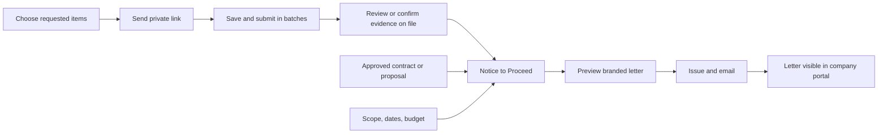

# Tailored onboarding and Notice to Proceed

## Experience

An invitation requests only the information an administrator selects for that company. Select all for a new firm, or keep existing qualification evidence with the review team. Company profile and project references are independently selectable. Selection is a case snapshot and never changes another company's checklist.

Unchecked requirements stay in the internal review record. Administrators can record prior approval with a reference and a validity date, or mark nonapplicable requirements using the existing review controls. Hiding an upload does not silently certify missing evidence.

Firms save and submit available documents incrementally. Submitting one batch does not lock unrelated missing items. Submitted and verified evidence remains protected during review. Suspension and rejection continue to prevent uploads.

## Workflow

## Release record

Each project qualification has one Notice to Proceed with a saved draft and an immutable issued snapshot. The administrator records the approved agreement reference, approval date, authorized scope, start and completion dates, budget in cents, recipient, and any site-access or permit instructions. A linked commitment is checked against the project and company and must be approved or executed; external approvals use explicit human confirmation and a reference. The server rechecks onboarding and all required fields before issue. The approval user and time, rendered letter, and delivery status are retained.

The same APAS green and gold letterhead is used for preview, email, portal, and print/PDF. A compact readiness diagram explains the five release checks. A brief, reduced-motion-aware celebration appears after successful issue, once per action.

## Implementation and verification

1. Add case request settings, prior-approval evidence, immutable NTP records, scoped RPCs, and database gates.
2. Add reusable request picker to new onboarding and resend flows.
3. Update the external portal for incremental intake and issued NTP visibility.
4. Add draft editing, release checks, letter preview, and explicit email delivery.
5. Verify hidden requirements cannot be modified externally, expired prior approvals block NTP, unapproved contracts block issue, and issued letters cannot be amended.
6. Run targeted tests, build, and CI. Merge and deploy through the existing GitHub, Supabase, and Cloudflare workflows; do not send live notices during verification.
