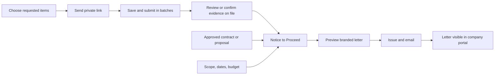

# Tailored onboarding and Notice to Proceed

## Experience

An invitation requests only the information an administrator selects for that company. Select all for a new firm, or keep existing qualification evidence with the review team. Company profile and project references are independently selectable. Selection is a case snapshot and never changes another company's checklist.

Unchecked requirements stay in the internal review record. Administrators can record prior approval with a reference and a validity date, or mark nonapplicable requirements using the existing review controls. Hiding an upload does not silently certify missing evidence.

Firms save and submit available documents incrementally. Submitting one batch does not lock unrelated missing items. Submitted and verified evidence remains protected during review. Suspension and rejection continue to prevent uploads.

## Workflow



## Release record

Each project qualification has one Notice to Proceed with a saved draft and an immutable issued snapshot. The administrator records the approved agreement reference, approval date, authorized scope, start and completion dates, budget in cents, recipient, and any site-access or permit instructions. A linked commitment is checked against the project and company and must be approved or executed; external approvals use explicit human confirmation and a reference. The server rechecks onboarding and all required fields before issue. The approval user and time, rendered letter, and delivery status are retained.

The same APAS green and gold letterhead is used for preview, email, portal, and print/PDF. A compact readiness diagram explains the five release checks. A brief, reduced-motion-aware celebration appears after successful issue, once per action.

## Proposal-driven NTP drafting

The NTP workflow can fill a professional draft from an approved proposal and its approved value schedule. This is not the signed-proposal extraction workflow and it does not rewrite the proposal. The proposal remains the source of truth. The draft helper only copies the proposal reference, approval date, selected scope examples, authorized value, and applicable terms into the NTP fields so the administrator can review, add the start and completion dates, confirm prerequisites, and issue.

Boundary rules:

1. Signed or executed proposals stay as uploaded source records.
2. AI is used for proposals written from scratch, not to rewrite signed client proposals.
3. The NTP draft helper may write clean NTP language from approved proposal facts, but it must not invent scope, dates, budget, or terms.
4. Start date and completion date remain human-confirmed release fields.
5. The issued NTP is immutable. Amendments go through project correspondence or a new approved authorization record.

## Official letterhead and email delivery

The Notice to Proceed must look like an official APAS authorization, not an internal checklist printout.

Approved implementation direction:

1. The browser preview, company portal view, print view, email HTML, and PDF attachment use the same shared NTP letter template.
2. The shared template reads the current workspace `company_branding` record for company name, logo, primary and secondary colors, address, phone, email, website, and footer text.
3. If the branding record is incomplete, the safe fallback is APAS Consulting branding.
4. Every generated NTP is automatically signed:

   ```text
   /s/ Hardeep Anand, PE
   Hardeep Anand, PE
   Authorized Representative | APAS Consulting
   ```

5. Email delivery uses the existing Supabase `contractor-ntp` Edge Function and Resend. The sender identity is `Hardeep Anand, PE <hardeep@apas.ai>`.
6. The Resend key is stored only as the Supabase `RESEND_API_KEY` Edge Function secret. It is not exposed in the browser, Markdown, local environment examples, or client side code.
7. If `RESEND_API_KEY` is missing, the issued NTP remains saved and printable, and the UI reports that email delivery is not configured.

Current verification:

- Supabase secrets include `RESEND_API_KEY`. The value was not exposed or copied.
- Local typecheck passed.
- Focused NTP letter tests passed.
- A regression assertion now requires the Hardeep Anand, PE signature block in the rendered NTP output.

## Approval boundary for release

This NTP release should be isolated from the broader local Proj OS revamp.

Files in scope:

1. `src/components/contractors/NoticeToProceed.tsx`
2. `supabase/functions/_shared/noticeToProceed.ts`
3. `supabase/functions/contractor-ntp/index.ts`
4. `src/lib/contractors/noticeToProceed.test.ts`
5. `docs/TAILORED_ONBOARDING_NTP_PLAN.md`

Files and workstreams out of scope unless separately approved:

1. Dashboard, portfolio, project navigation, meeting hub, and mobile first revamp files.
2. Proj OS Notion frontend release.
3. Hermes production or restricted runtime changes.
4. Any broad Cloudflare frontend deploy that would publish unrelated dirty work.

Recommended approval sequence:

1. Review the local NTP screen and letter preview.
2. Confirm the workspace branding record has the final APAS Consulting logo, address, email, phone, website, colors, and footer.
3. Approve a scoped Git commit containing only the NTP files above.
4. Deploy only the `contractor-ntp` Supabase Edge Function for the branded email and PDF behavior.
5. If frontend NTP UI changes must be visible live, approve a scoped frontend release only after confirming no unrelated revamp files are included.
6. Live smoke test on one non destructive issued NTP:
   - generate from approved proposal,
   - confirm schedule and budget,
   - issue,
   - email,
   - verify received HTML and PDF attachment,
   - confirm the issued notice is locked.

## Implementation and verification

1. Add case request settings, prior-approval evidence, immutable NTP records, scoped RPCs, and database gates.
2. Add reusable request picker to new onboarding and resend flows.
3. Update the external portal for incremental intake and issued NTP visibility.
4. Add draft editing, release checks, letter preview, and explicit email delivery.
5. Verify hidden requirements cannot be modified externally, expired prior approvals block NTP, unapproved contracts block issue, and issued letters cannot be amended.
6. Verify official letterhead, Hardeep Anand, PE signature, Resend delivery fallback, and branded PDF attachment.
7. Run targeted tests, build, and CI. Merge and deploy through the existing GitHub, Supabase, and Cloudflare workflows; do not send live notices during verification.
