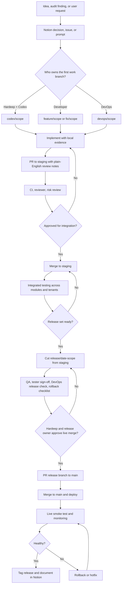

# Proj OS Enterprise SDLC

Proj OS uses a gated branch flow so several people can work at once without
turning `main` into a shared scratchpad.

## Roles

| Role | Responsibility |
| --- | --- |
| Product owner | Confirms scope, business priority, and go/no-go. |
| Codex operator | Creates implementation branches, documents evidence, opens PRs. |
| Developer | Implements or reviews code and keeps scope tight. |
| Tester | Runs acceptance checks and records defects. |
| Reviewer | Reviews risk, code, tests, and architecture fit. |
| DevOps owner | Owns deployment window, environment config, rollback execution. |
| Release owner | Makes final merge/release decision. |

One person can hold multiple roles on small releases, but the role gate still
has to be explicit in the PR or release notes.

## Branch Levels

| Level | Branch | Meaning |
| --- | --- | --- |
| 0 | `main` | Live production baseline. This is what is live now. |
| 1 | `codex/*`, `feature/*`, `fix/*`, `devops/*` | Workbench branches where changes start. These are allowed to move fast. |
| 2 | `staging` | Integration branch where reviewed work is tested together. |
| 3 | `release/*` | QA-frozen release candidate. Only release fixes should enter here. |
| 4 | `main` | Production branch after final approval. |

Hardeep + Codex work starts at Level 1 in `codex/*`. Developer work starts at
Level 1 in `feature/*` or `fix/*`. DevOps work starts at Level 1 in `devops/*`.
All work, regardless of author, must move upward through PRs and evidence gates.

## Branch Flow

## Parallel Work Architecture

Parallel work is expected. The control point is `staging`, not `main`.

- Codex may work on one or more `codex/*` branches.
- Developers may work on independent `feature/*` or `fix/*` branches.
- DevOps may work on `devops/*` branches.
- Each branch gets its own PR into `staging`.
- The PR must explain the change in plain English so Hardeep can review it.
- Cross-branch conflicts are resolved before merge to `staging`.
- Combined behavior is tested in `staging`.
- A `release/*` branch freezes the exact set of changes intended for live.
- `main` receives only approved release candidates or approved emergency hotfixes.

## Gates

### Implementation Gate

- Work starts from current `main` or approved `staging`.
- Codex work starts in `codex/*` unless Hardeep explicitly requests a different
  branch.
- Scope is linked to a prompt, issue, audit finding, or Notion decision.
- Branch name identifies intent.
- No direct production environment changes.

### Review Gate

- PR uses the enterprise template.
- PR names the source branch, target branch, review purpose, and promotion level.
- CI is green or every failing check is explained.
- User-facing changes include browser evidence.
- Migrations include dry-run evidence.
- RLS/auth/payment/portal changes receive additional review.

### Release Gate

- Release checklist is complete.
- Tester sign-off is recorded.
- DevOps owner confirms deployment window and rollback access.
- Release owner approves merge to `main`.

### Post-Deploy Gate

- Live route renders.
- Authenticated route is checked when the release affects signed-in workflows.
- Data integrity checks run when financial or migration behavior changed.
- Release tag is created after production is confirmed healthy.

## Daily Documentation Rule

Before a release candidate goes live, document the change by date in both places:

- GitHub: PR description, commit history, and release notes identify the change,
  evidence, tests, risk, and rollback path.
- Notion: Command Center or release note records the date, scope, branch, PR,
  commit SHA, tester result, DevOps result, and release decision.

## Hotfix Path

Emergency fixes may branch from `main` as `hotfix/<scope>`. A hotfix still needs
CI, a reviewer, rollback notes, and a post-deploy smoke test. After release,
back-merge the hotfix into `staging` so the next planned release does not
reintroduce the defect.
