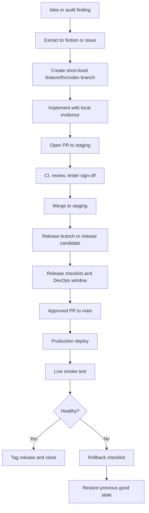

# Proj OS Enterprise SDLC

Proj OS uses a gated branch flow so several people can work at once without
turning `main` into a shared scratchpad.

## Roles

| Role | Responsibility |
| --- | --- |
| Product owner | Confirms scope, business priority, and go/no-go. |
| Codex operator | Creates implementation branches, documents evidence, opens PRs. |
| Developer | Implements or reviews code and keeps scope tight. |
| Tester | Runs acceptance checks and records defects. |
| Reviewer | Reviews risk, code, tests, and architecture fit. |
| DevOps owner | Owns deployment window, environment config, rollback execution. |
| Release owner | Makes final merge/release decision. |

One person can hold multiple roles on small releases, but the role gate still
has to be explicit in the PR or release notes.

## Branch Flow

## Gates

### Implementation Gate

- Work starts from current `main` or approved `staging`.
- Scope is linked to a prompt, issue, audit finding, or Notion decision.
- Branch name identifies intent.
- No direct production environment changes.

### Review Gate

- PR uses the enterprise template.
- CI is green or every failing check is explained.
- User-facing changes include browser evidence.
- Migrations include dry-run evidence.
- RLS/auth/payment/portal changes receive additional review.

### Release Gate

- Release checklist is complete.
- Tester sign-off is recorded.
- DevOps owner confirms deployment window and rollback access.
- Release owner approves merge to `main`.

### Post-Deploy Gate

- Live route renders.
- Authenticated route is checked when the release affects signed-in workflows.
- Data integrity checks run when financial or migration behavior changed.
- Release tag is created after production is confirmed healthy.

## Hotfix Path

Emergency fixes may branch from `main` as `hotfix/<scope>`. A hotfix still needs
CI, a reviewer, rollback notes, and a post-deploy smoke test. After release,
back-merge the hotfix into `staging` so the next planned release does not
reintroduce the defect.
