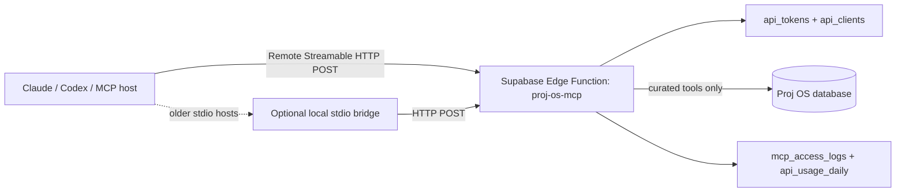

# Proj OS MCP Gateway

Proj OS now has an MCP gateway so Claude, Codex, and other MCP-compatible hosts can work with Proj OS project data through controlled tools.

## Architecture

The MCP gateway is an enterprise broker, not a direct database connection.



## Endpoint

Remote MCP endpoint:

```text
https://<your-supabase-project-ref>.supabase.co/functions/v1/proj-os-mcp
```

The endpoint expects:

```text
Authorization: Bearer <short-lived OAuth access token>
Content-Type: application/json
```

## Authentication model

Use the existing Proj OS API client flow:

1. In Proj OS, go to API clients.
2. Create an API client with the needed scopes.
3. Exchange the client ID and client secret at `oauth-token`.
4. Put only the short-lived access token into the MCP host.

Do not paste database keys or service-role keys into Claude, Codex, Telegram, Slack, or any agent.

Recommended read-only scopes:

```text
read:mcp
read:projects
```

Recommended controlled write scopes:

```text
write:projects
write:client-updates
```

## Tools exposed

| Tool | Scope | Purpose |
| --- | --- | --- |
| `proj_os.search_projects` | `read:projects` | Search tenant-scoped projects. |
| `proj_os.get_project_context` | `read:projects` | Pull a project context packet with updates, action items, and meetings. |
| `proj_os.list_action_items` | `read:projects` | Review project action items. |
| `proj_os.create_action_item` | `write:projects` | Create project action items. |
| `proj_os.create_client_update_draft` | `write:client-updates` | Create draft client updates only. It does not publish or email. |
| `proj_os.record_project_note` | `write:projects` | Record a note in project communications. |

## Claude connection

For Claude remote custom connectors, use the public Cloudflare endpoint:

```text
https://projos.ai/mcp
```

Claude discovers the Proj OS authorization server through:

```text
https://projos.ai/.well-known/oauth-protected-resource/mcp
```

The connector supports Dynamic Client Registration and PKCE authorization code exchange. When Claude opens the authorization page, enter the deployed `PROJ_OS_MCP_SHARED_SECRET` to approve the connector. Claude then receives a signed bearer token that `/mcp` accepts without exposing database credentials.

For header-capable MCP clients, you may also configure:

```text
Authorization: Bearer <PROJ_OS_MCP_SHARED_SECRET>
```

For Claude Desktop or any host that expects a local stdio command, use the bridge:

```json
{
  "mcpServers": {
    "proj-os": {
      "command": "node",
      "args": ["/Users/apas/Documents/GitHub/nspire-guardian-hub/tools/projos-mcp-stdio.mjs"],
      "env": {
        "PROJ_OS_MCP_URL": "https://<your-supabase-project-ref>.supabase.co/functions/v1/proj-os-mcp",
        "PROJ_OS_MCP_TOKEN": "<short-lived-oauth-access-token>"
      }
    }
  }
}
```

## Enterprise controls included

- Tenant scoping through project property/client workspace ownership.
- Existing API client and OAuth-token issuance.
- Hashed tokens only in the database.
- Scope-gated tools.
- No raw SQL tool.
- No publish/email tool in the initial surface.
- Origin validation for browser-origin requests.
- Per-client API usage metering.
- MCP-specific audit logging without storing prompts or bearer tokens.

## Next hardening phase

Recommended next steps before wide customer rollout:

1. Add an admin screen for MCP access logs.
2. Add token rotation reminders and one-click revocation UX.
3. Add per-tool allow/deny settings per tenant.
4. Add a read-only “client portal summary” tool for owner-facing assistants.
5. Add a publishing workflow only after human approval is explicit in Proj OS.
