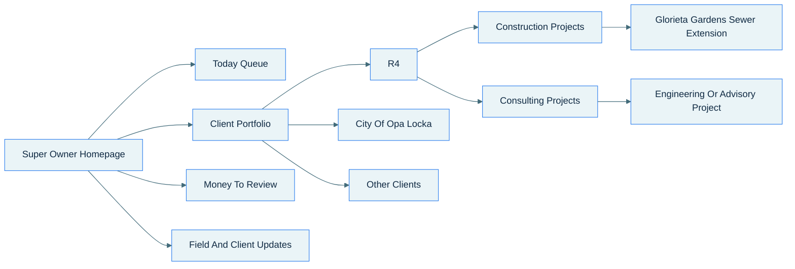
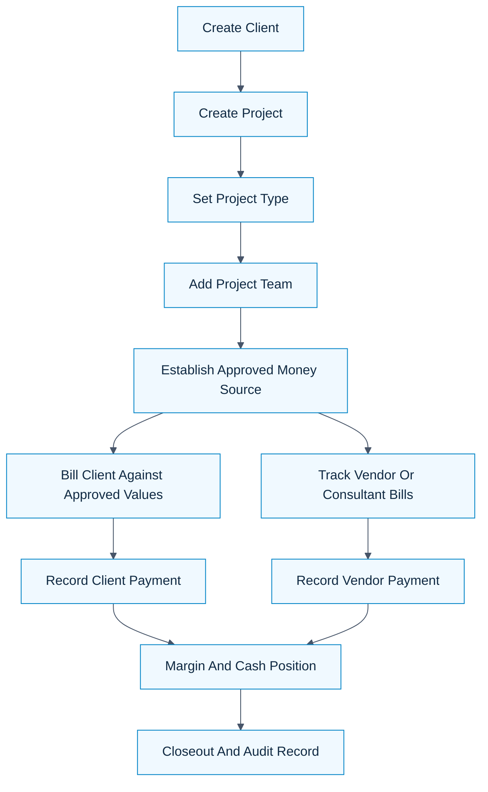
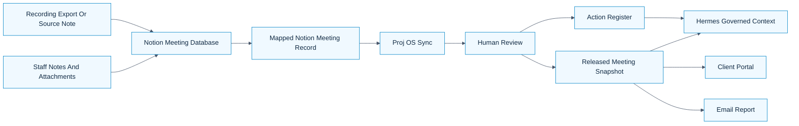
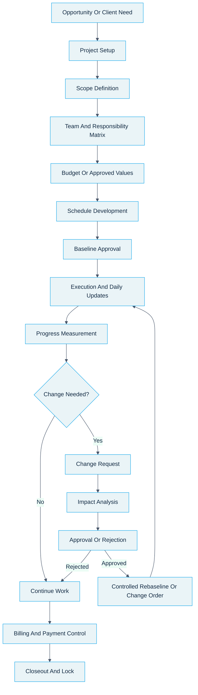
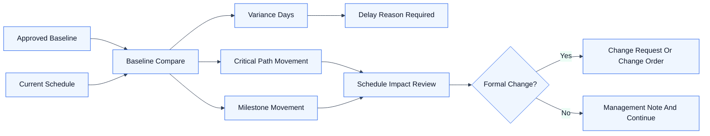
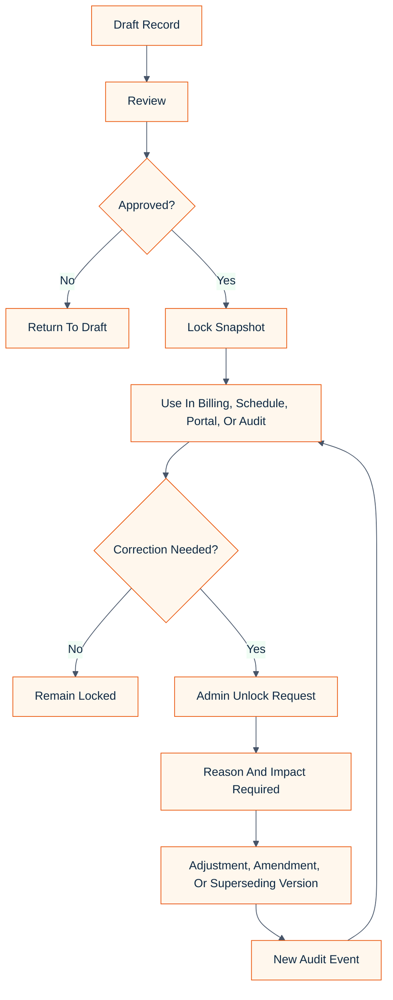
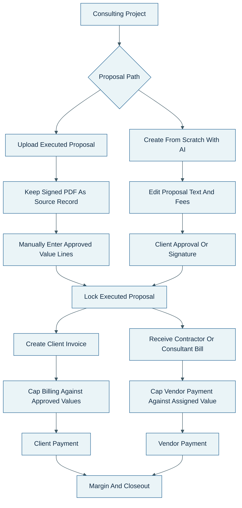
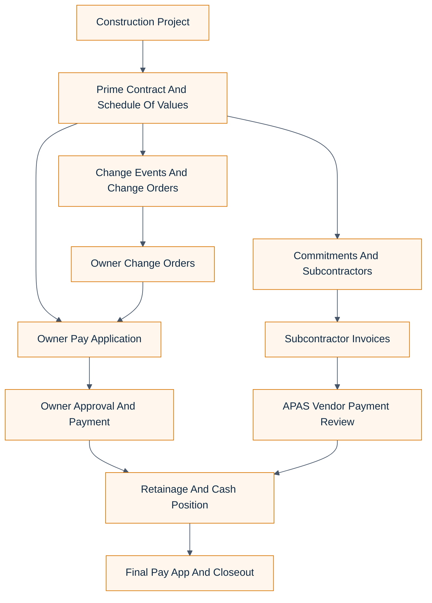
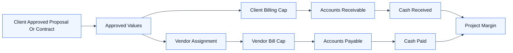
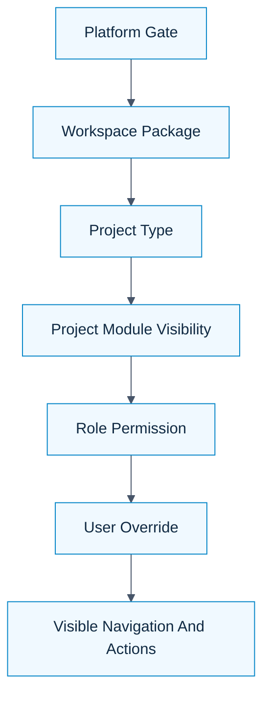

# Proj OS Business Lifecycle And Navigation Audit

Date: 2026-09-22
Status: Draft for product and UX alignment
Audience: APAS ownership, product, engineering, project operations, and implementation leads

## Living Document Rule

This Markdown file is the canonical local blueprint for the Proj OS business lifecycle, navigation, modular packaging, desktop UX, and iPhone UX direction. As product decisions are accepted, this file must be updated before or alongside implementation so Notion, code, QA, and future release work do not drift.

Status labels in this file mean:

- **Agreed or planned:** Product direction has been accepted, but the full production implementation is not complete.
- **Implemented locally:** Code exists in the local checkout and has passed local verification, but it has not necessarily been pushed, merged, or deployed.
- **Verified:** The behavior has been checked with tests, build, or browser review and the evidence is recorded.
- **Production live:** The change has been pushed, deployed, and checked on the live domain.

## Executive Summary

Proj OS already contains many of the right parts: projects, clients, organizations, project teams, proposals, construction pay applications, client invoices, vendor invoices, portals, field accountability, documents, reports, module gates, and role based access.

The product problem is that the parts are not yet presented as one obvious business lifecycle. A user can technically reach many surfaces, but the journey can feel like a maze because the application asks users to understand the internal module map before they understand the work they are trying to complete.

The north star should be simple:

1. A super owner opens Proj OS and first sees clients and active work by client.
2. A project opens into one guided project cockpit.
3. The project cockpit shows the correct lifecycle for the project type.
4. Construction projects lead users through contracts, change orders, pay apps, vendor invoices, retainage, payments, and closeout.
5. Consulting projects lead users through proposal or schedule of values setup, client invoices, vendor or consultant bills, payments, margin, reports, and closeout.
6. Clients, owners, contractors, consultants, and internal staff only see what their role and module package allows.
7. Enterprise customers can turn on the full suite; smaller customers can buy only construction, consulting, field accountability, portals, AI, water intelligence, or property operations modules.

Current local status:

- **Implemented locally and verified:** client first dashboard portfolio cards, closed project hiding in default project lists, R4 presentation grouping for Glorieta style aliases and named standalone consulting projects, project lifecycle panel, removal of the large Glorieta Gardens Site Accountability spotlight from the organization page, and the Notion first visible meeting workflow.
- **Partially deployed and verified on 2026-09-22:** Proj OS public Notion OAuth database schema now exists in Supabase for `notion_connections`, `notion_project_mappings`, and `notion_sync_runs`. The isolated `notion` and `notion-oauth-callback` Edge Functions are deployed. The `notion` control endpoint correctly rejects unauthenticated calls with `401`. The public callback safely redirects invalid or missing state to `https://projos.ai/settings?notion=error`. Notion OAuth cannot complete yet because `NOTION_OAUTH_CLIENT_ID` and `NOTION_OAUTH_CLIENT_SECRET` are not configured in Supabase secrets.
- **Implemented locally, pending verification:** Proj OS settings UI, safe status surface, selected source search, and client/project mapping UI. These are local app changes and are not proven on the live frontend until the frontend release is explicitly approved.
- **Verified outside Proj OS on 2026-09-22:** the personal desktop Hostinger Hermes backend was updated from `0.20.1` to `0.21.4` and reported healthy. User approved Notion OAuth on the active Hostinger profile. Hermes discovered 45 Notion MCP tools. A minimal read only `notion-list-private-pages(limit:1)` check returned HTTP 200 without an RPC or tool error. The desktop Notion tool list loaded without an Authenticate warning. This proves the direct Hermes vendor Notion MCP read connection is alive. It does not prove writes, comments, meeting summarization, or a Proj OS to Notion sync workflow.
- **Verified personal Hermes to Proj OS on 2026-09-22:** the active personal desktop Hostinger Hermes profile now authenticates to Proj OS MCP through OAuth rather than the old literal bearer configuration. `hermes mcp test proj_os` connected with OAuth 2.0 and discovered 35 tools. A direct read only `proj_os_health` call returned HTTP 200, `isError: false`, `connection_mode: workspace_dynamic`, and `project_count: 53`. Hermes Desktop MCP JSON was saved in OAuth form and MCP was reloaded. This proves the personal desktop profile can read Proj OS through MCP. It does not prove Proj OS writes, client releases, financial changes, or restricted production runtime readiness.
- **Implemented locally and verified:** proposal-driven Notice to Proceed drafting now fills the NTP from approved proposal facts, uses an official branded letterhead, signs automatically as Hardeep Anand, PE, and prepares branded Resend email plus PDF delivery through the `contractor-ntp` Edge Function. Supabase already has the `RESEND_API_KEY` secret configured. This is local code plus verified tests; a scoped Git commit, isolated Supabase function deploy, and live smoke test are still required before claiming production live.
- **Agreed or planned:** sync job from mapped Notion sources into reviewed meeting/project records, Hermes meeting tools, full grouped project navigation rewrite, full mobile first rewrite, package based navigation enforcement, and production deployment of this revamp.
- **Not authorized in this local pass:** replacing the current GitHub/live production version. Push and deploy require explicit user direction.

## Current App Surfaces Verified In Source

The audit reviewed the signed in application routes, navigation components, project screens, financial navigation, proposal intake, invoice/pay app surfaces, module gating, and mobile app spec.

| Area | Current source of truth | What exists now | UX implication |
| --- | --- | --- | --- |
| Main routing | `src/App.tsx` | Public site, auth, owner portal, ops portal, protected app, project routes, financial routes, admin routes, water intelligence routes | The product is broad and needs stronger grouping |
| Global sidebar | `src/components/layout/AppSidebar.tsx` | Command, Portfolio, Resident Voice, Property Ops, and other module groups | Useful, but can overwhelm when too many modules are enabled |
| Client to projects tree | `src/components/layout/OrgProjectTree.tsx` | Clients expand to projects in the sidebar | Correct model, but too hidden for the super owner front door |
| Organization detail | `src/pages/organizations/OrganizationDetailPage.tsx` | A client page shows that client projects grouped by construction and consulting | This should become a primary portfolio pattern |
| Project navigation | `src/lib/projects/projectNav.ts` | Project tabs are grouped into Engagement, Field, Money, Docs, Client, Admin | Good foundation, but should be reworded around job to be done and project type |
| Financial sub navigation | `src/components/financial/FinancialSubNav.tsx` | Construction and consulting use different primary financial tabs | Good separation, but the lifecycle is still too tab heavy |
| Proposal intake | `src/pages/projects/financial/ProposalGeneratorPage.tsx` | Two modes exist: AI scratch proposal and uploaded executed proposal with manual approved value lines | Correct business rule exists; UI should make it almost impossible to misunderstand |
| Proposal builder | `src/pages/projects/financial/ProposalBuilderPage.tsx` | Editable value lines, project directory linked lead type, executed PDF, lock, invoice entry point | Good source of truth, but it should be surfaced as a guided step |
| Vendor invoices | `src/pages/projects/financial/InvoicesPage.tsx` | Prime pay apps and subcontractor invoices grouped by party | Strong concept; label and path should avoid confusing owner pay apps with vendor invoices |
| Module control | `src/contexts/ModuleContext.tsx` and `src/pages/admin/ModulePackagesPage.tsx` | Platform gates, workspace toggles, user overrides, enterprise package concept | Ready to be packaged as sellable product tiers |
| Mobile direction | `docs/ux/proj-os-mobile-signed-in-app-spec.md` | Mobile first app spec already exists | This audit should extend that spec into a full lifecycle redesign |

## Primary Product Problem

The application currently has strong individual modules, but users need a guided operating model. The navigation should not ask someone to know whether they need "commitments," "client invoices," "proposals," "vendor inbox," "pay apps," or "ledger" before they know the simple business question.

The app should first ask:

- Which client?
- Which project?
- What type of project?
- What stage is this project in?
- What are you trying to do now?

Then Proj OS should route the user to the right module and explain the next step.

## Recommended Information Architecture

### Level 1: Super Owner Homepage

The signed in homepage should be client first for an owner or super owner.

Recommended first screen:

1. Today
2. Clients
3. Active projects
4. Money requiring action
5. Field or client updates requiring action
6. Module launcher, collapsed by default

The client section should show R4, City of Opa Locka, APAS internal, and other clients as portfolio cards. Opening R4 should immediately show every R4 project without forcing the user through all projects and manual filters.

### Level 2: Client Workspace

Each client should have a portfolio workspace.

The client workspace should show:

- All projects under that client.
- Construction projects in one row.
- Consulting projects in one row.
- Open approvals.
- Open invoices or pay apps.
- Open client updates.
- Outstanding field proof or closeout items.
- Team and portal access.

This already exists in part in the organization detail page, but it should become a polished client command page and be easy to reach from the homepage.

### Level 3: Project Cockpit

Each project should open to one cockpit, not a crowded module wall.

Recommended project cockpit groups:

| Group | Purpose | Examples |
| --- | --- | --- |
| Overview | What is this project and what needs attention? | status, phase, health, money snapshot, next action |
| Scope And Team | Who is involved and what is approved? | project directory, contractors, consultants, proposal, prime contract |
| Money | Billing and payment lifecycle | proposal, pay app, invoice, vendor bill, payment, retainage, margin |
| Field | Proof and project execution | photos, accountability, punch, daily reports, permits, safety |
| Plan | Schedule and coordination | milestones, meetings, RFIs, submittals, procurement |
| Files And Client | Documents and owner communication | reports, repository, client updates, portal |
| Admin | Project setup and module visibility | project type, company, modules, closeout |

## Business Lifecycle Model

### Future-Only Change Boundary

This lifecycle standard is for future project setup and future application behavior. It must not rewrite finalized or locked historical records.

The R4 / Glorieta Gardens sewer extension project and other finalized records should remain readable, reportable, and auditable, but not silently mutated by new lifecycle defaults. If a historical project needs correction, the system should require an administrator unlock, a reason, a before snapshot, an after snapshot, and an audit event. The default behavior for closed projects remains read-only.

Recommended implementation rule:

1. New lifecycle templates apply only to new projects and explicitly opted-in active projects.
2. Closed projects stay locked.
3. Approved proposals, executed change orders, pay applications, final invoices, and closeout records stay locked.
4. Any correction to a locked record uses a controlled adjustment or superseding record, not a silent edit.
5. Audit history is never deleted.

### Shared Lifecycle

All project types need a clean source of truth for approved money.

### Meeting And Client Update Lifecycle

Meetings should be Notion first. Proj OS should not become a second raw source intake system.

Accepted rule:

1. Each authorized Proj OS user can connect their own Notion account or workspace through the public Proj OS Notion OAuth integration.
2. Recording exports, staff notes, attachments, comments, source material, and raw meeting records go into Notion first.
3. Proj OS imports the mapped and approved Notion meeting record into the client or project meeting journal.
4. Authorized Notion comment capabilities can support collaboration, but Proj OS must keep human authorization before posting updates, releasing client records, or making content client visible.
5. Proj OS is where the team reviews project sections, assigns actions, releases client visible snapshots, emails reports, and records audit.
6. Hermes can draft intelligence from governed context, but cannot publish, email, or overwrite client records without human approval.

Current implementation status:

- **Implemented locally and verified:** visible source upload and paste meeting record workflow removed from the client meeting hub; visible UI now shows a Notion source panel and a disabled explanatory sync path.
- **Partially deployed and verified:** public Proj OS Notion OAuth schema and Edge Functions are now live in Supabase. Token vault and mapping tables exist. The callback and authenticated control function respond correctly to smoke tests.
- **Implemented locally, pending verification:** status/search/map settings card and client/project mapping UI.
- **Verified direct Hermes to Notion read status:** personal desktop Hermes can authenticate to Notion through the vendor MCP profile and can perform a minimal read only request. This is separate from the Proj OS public Notion OAuth integration and separate from any restricted production Hermes runtime.
- **Configured capability direction:** public install scope; read, update, and insert content; user information including email; read comments; insert comments. Capability selection does not by itself mean Proj OS has shipped all sync/comment workflows.
- **Not yet verified:** Notion OAuth consent from Proj OS to Notion, writes to Notion, comment insertion, meeting summarization end to end, Hermes write tools to Proj OS, restricted production Hermes runtime behavior, and approved Notion records flowing back into Proj OS as reviewed project actions.
- **Agreed or planned:** Notion sync job, source reconciliation, Hermes tooling, comment workflow UI, and admin sync monitoring.

Practical operating model today:

1. Put raw meeting notes, recordings, attachments, and working thoughts in Notion.
2. Use Hermes against the connected Notion account to find pages, summarize notes, organize decisions, and draft possible follow ups.
3. Treat those Hermes outputs as working drafts, not official Proj OS project records.
4. When the Proj OS integration is connected and verified, map the Notion source page to the correct client and project.
5. Proj OS compares mapped Notion content against controlled project records, prepares proposed actions, and keeps the reviewed action, client release, email, portal record, and audit trail.
6. A human approves official actions and client visible releases.

Concrete R4 example:

1. Meeting notes for an R4 project are stored in Notion.
2. Hermes summarizes the decisions, identifies commitments, and drafts project specific actions.
3. When the Proj OS workflow is connected, Proj OS checks those proposed actions against the R4 project record, financial controls, schedule, and client release status.
4. APAS reviews the proposed updates.
5. Approved actions become official Proj OS records, and only approved snapshots are released to the client portal or email.

Connection boundary:

- **Hermes vendor Notion MCP OAuth:** personal desktop connection verified for read access. This is useful now for finding and summarizing Notion content.
- **Proj OS public Notion OAuth:** database schema and Edge Functions are deployed. OAuth secrets are not configured, so consent cannot complete yet. The Notion integration must use this callback URL: `https://xlfwzqpixlrnntzqhvcm.supabase.co/functions/v1/notion-oauth-callback`.
- **Hermes to Proj OS personal desktop profile:** supported auth contract exists through `oauth-token` and `proj-os-mcp`. The active Hostinger personal profile is now verified through OAuth: 35 tools discovered and read only `proj_os_health` returned HTTP 200, `isError: false`, `connection_mode: workspace_dynamic`, and `project_count: 53`. Hermes Desktop was saved and reloaded with the OAuth MCP JSON.
- **Hermes to Proj OS restricted production profile:** not touched and not verified in this pass. A personal Hermes profile is not the same thing as a restricted production runtime. Do not use personal profile success as proof of production readiness, write authority, or automated client release authority.

### Project Management Lifecycle Standard

Future projects should follow a controlled project management lifecycle that separates planning, baseline, execution, change control, billing, and closeout.

### Schedule Analysis Best Management Practice

Schedule management should not be just a Gantt view. It should explain whether the project is on time, why it changed, who owns the next action, and whether a schedule change should become a formal change event or change order.

Minimum schedule controls for future projects:

| Control | Purpose | Required behavior |
| --- | --- | --- |
| Current schedule | Live working plan | Can be edited while the project is active, subject to role permissions |
| Baseline schedule | Approved reference plan | Captured after scope, contract, proposal, or NTP approval |
| Look ahead window | Near-term management | 2 week, 4 week, and custom views for upcoming work |
| Critical path | Delay sensitivity | Flag tasks that control project completion |
| Milestones | Contract and client commitments | Track submissions, approvals, mobilization, substantial completion, final completion, closeout |
| Variance | Difference from baseline | Show start variance, finish variance, duration variance, and percent complete |
| Delay reason | Explanation | Required for material date changes after baseline |
| Schedule impact days | Business impact | Carried into change requests and change orders when applicable |
| Rebaseline | New approved reference | Requires approval, reason, and snapshot; never overwrites the old baseline |

Recommended schedule analysis views:

1. **Baseline compare:** current schedule versus approved baseline.
2. **Critical path view:** tasks that drive final completion.
3. **Look ahead:** work due in the next 14, 30, or 60 days.
4. **Slippage register:** tasks that moved after baseline and why.
5. **Change impact view:** pending or approved changes with cost and schedule impact.
6. **Owner report:** simple explanation of what changed, why it changed, and what it means.

### Locking And Change Control Standard

The application should treat important project records as living drafts until they are approved, then locked once they become relied-upon business records.

| Record type | Draft state | Lock trigger | Future change method |
| --- | --- | --- | --- |
| Project setup | Planning | Project activated or notice to proceed issued | Admin change with reason |
| Project team | Editable | Proposal, commitment, or vendor bill uses the party | Add/remove by admin with audit trail |
| Proposal from scratch | Draft | APAS signs and/or client approves | Amendment or revision |
| Uploaded executed proposal | Intake | Signed PDF uploaded, approved values entered, and executed record locked | Superseding amendment |
| Approved values | Draft rows | Proposal/contract executed | Adjustment line or amendment |
| Prime contract | Draft | Contract approved | Change order or admin correction |
| Schedule baseline | Candidate baseline | Baseline approved | New baseline version; never overwrite prior baseline |
| Change order | Draft | Sent, signed, approved, or rejected | Reopen only by allowed role with reason |
| Pay app | Draft | Submitted/signed/approved/finalized | Void/supersede/adjust; no silent edits |
| Vendor bill | Draft/submitted | Approved or paid | Credit memo, adjustment, or admin reopen with reason |
| Closed project | Active | Closeout certified | Admin reopen with reason and lifecycle event |

Change control should follow this pattern:

### Best Practice For Existing Locked Projects

Existing projects that are closed, finalized, or relied upon for client records should not be mass migrated into new lifecycle logic. They should receive compatibility views only.

For R4 / Glorieta Gardens sewer extension:

- Keep existing pay applications, change orders, vendor payments, retainage logic, and closeout records as the historical record.
- Do not recalculate or relabel finalized billing records through a new template migration.
- Allow read-only reporting against the old structure.
- If a correction is needed, create an explicit adjustment or superseding record with a reason.
- Any unlock should require an administrator, a reason, and visible audit history.

### Consulting Project Lifecycle

Consulting does not use construction pay apps. Consulting should use proposal and client invoices.

There should be exactly two proposal paths:

1. Write from scratch with AI.
2. Upload executed proposal and manually enter approved value lines.

For uploaded executed proposals, the signed PDF is the legal source record. AI should not rewrite the scope or extract new proposal language. The only structured data needed is the approved value schedule used for client billing, vendor billing, margin, and audit.

### Construction Project Lifecycle

Construction should be pay app based, with commitments, change orders, retainage, vendor invoices, and owner payments.

## Source Of Truth Model

The approved schedule of values is the bridge between client money and vendor money.

Industry term recommendation:

- Use **Schedule of Values** for construction pay app line items.
- Use **Approved Value Schedule** for consulting projects, because the same concept applies but the project may not be a formal AIA pay app job.
- In the UI, use the plain label **Approved Values** and show the industry term in helper text.

## Enterprise Packaging Recommendation

Proj OS should be sold as modular suites, with Enterprise as the full unlock.

### Recommended Packages

| Package | Buyer | Includes | Excludes by default |
| --- | --- | --- | --- |
| Construction Management | Builders, owner reps, construction teams | projects, contracts, commitments, change orders, pay apps, vendor invoices, field proof, documents, reports | consulting specific proposal writing, water intelligence, property ops unless added |
| Consulting Management | advisory firms, engineering teams, owner reps | clients, consulting projects, proposals, approved value schedule, client invoices, consultant/vendor bills, reports, CRM context | construction pay apps unless added |
| Field Accountability | site walks, punch lists, before and after proof | accountability, photos, walkthroughs, punch, client evidence portal | financial modules unless added |
| Owner Portal | external owner/client access | client updates, approvals, documents, pay app or invoice review, questions, notes | internal admin and unrelated client data |
| Property Ops | property managers | work orders, inspections, occupancy, assets, voice complaints, stores, water where enabled | construction financial modules unless added |
| Water Intelligence | utility analysis customers | water bills, meter mapping, analytics, briefs, evidence, magic link | general project lifecycle unless added |
| AI Add On | teams that buy automation | proposal drafting, voice agent, report generation, document assist | disabled entirely for clients that do not buy or approve AI |
| Enterprise | larger customers | all modules, all portals, AI options, integrations, SSO, SCIM, API, advanced audit | none, unless intentionally hidden by role |

### Packaging Rules

1. Platform gate controls whether a module can be sold.
2. Workspace package controls whether the tenant bought the module.
3. Project type controls whether a module is relevant to that project.
4. Project module visibility controls whether the module is enabled on that specific project.
5. Role permissions control whether the user can view, create, update, approve, or delete.
6. User overrides can hide or reveal modules for specific people.

## Navigation Findings

### What Is Working

- There is a real client and project relationship.
- The sidebar already has a client to project tree.
- Organization pages already group projects by construction and consulting.
- Financial navigation already changes between construction and consulting.
- Consulting financial guard redirects consulting projects away from construction only paths.
- Proposal intake already separates AI scratch drafting from uploaded executed proposals.
- Proposal builder already links non APAS lines to project directory entries.
- Desktop resizable panels already exist for proposal pages.

### What Still Feels Like A Dead End

| User intent | Current risk | Recommended fix |
| --- | --- | --- |
| I own many clients and want R4 projects | User may go to All Projects and manually filter | Put client portfolio cards on the homepage and cockpit |
| I opened a project and want the next business step | Many tabs are visible and some are routed elsewhere | Show one project cockpit with next action and lifecycle stage |
| I need to invoice a consulting project | User must know proposal prerequisite and line item model | Show a guided checklist: team, proposal, approved values, lock, invoice |
| I need to pay a subcontractor | Vendor invoices exist, but source of truth may not feel tied to approved value schedule | Show vendor bills against assigned approved value and remaining balance |
| I need construction pay apps | Pay apps exist but live among many finance tabs | Present construction financials as a pay app command center |
| I need to use the app on iPhone | Desktop navigation density leaks into mobile | Use bottom nav and project action sheets; hide module lists behind five groups |
| I want to sell this modularly | Admin module gates exist but the buyer story is not explicit | Package modules into sellable plans and bind navigation to purchased modules |

## Recommended Desktop UX

### Homepage

Use a three lane desktop layout:

1. **Today**: alerts, approvals, unpaid or blocked money, unread client comments.
2. **Clients**: client cards with active projects, construction count, consulting count, outstanding approvals, open money.
3. **Work Queue**: proposals to lock, invoices to send, pay apps to review, vendor bills to approve, client updates to publish.

### Project Page

Use a project cockpit above module navigation:

- Project name, client, company, project type.
- Current lifecycle stage.
- One recommended next action.
- Money snapshot.
- Team readiness.
- Client portal status.
- Recent activity.

Then use simplified section navigation:

- Overview
- Scope And Team
- Money
- Field
- Plan
- Files And Client
- Admin

The current detailed tabs should remain available inside these groups, not all displayed at the same level.

### Financial Page

Replace flat financial tabs with a command center:

Construction:

1. Contract and schedule of values.
2. Change orders.
3. Pay applications to owner.
4. Vendor invoices from subs.
5. Payments and retainage.
6. Margin and closeout.

Consulting:

1. Proposal source and approved values.
2. Client invoices.
3. Contractor or consultant bills.
4. Payments.
5. Margin.
6. Closeout.

## Recommended iPhone UX

The phone app should be task first, not module first.

### Bottom Navigation

| Tab | Purpose |
| --- | --- |
| Home | today queue, continue work, critical approvals |
| Clients | client cards, project groups, recent projects |
| Capture | photo, field note, permit scan, walkthrough, document upload |
| Money | proposals, invoices, pay apps, approvals, vendor bills |
| More | reports, documents, people, settings, admin, modules |

### Project On iPhone

When a user opens a project on iPhone, show:

1. Project name and type.
2. One next action.
3. Money summary.
4. Open approvals or blockers.
5. Five large buttons: Money, Field, Plan, Files, Client.
6. Floating action button: Add update, capture photo, create invoice, create change order, send report, assign task.

Do not put the full desktop navigation on the first mobile screen.

## No Dead End Acceptance Checklist

Every major user journey should pass this checklist before release.

| Journey | Required completion path |
| --- | --- |
| Create client | Client exists, appears on homepage, has project creation action |
| Create project | Project has type, client, APAS company, modules, team, and cockpit |
| Add project team | Contractor or consultant appears in directory dropdowns |
| Upload executed proposal | Signed PDF stored, approved values entered manually, proposal can be locked |
| Write AI proposal | Draft created, edited, signed, sent or executed |
| Create consulting invoice | Requires approved proposal values, caps against remaining value |
| Create construction pay app | Requires prime contract and schedule of values |
| Submit vendor bill | Vendor is tied to project team and approved value or commitment |
| Pay vendor | Payment is tied to vendor bill and remaining approved amount |
| Client portal review | Client sees only approved project records |
| Mobile use | Same journey works at phone width without horizontal table dependence |
| Module off | Navigation hides unavailable modules and explains upgrade when appropriate |

## Implementation Recommendations

### Release 0: Stabilize The Blueprint And Protect Existing Locked Work

Goal: make the implementation governable before more code ships.

Scope:

- Keep this Markdown file as the product source of truth.
- Keep `docs/TAILORED_ONBOARDING_NTP_PLAN.md` as the contractor readiness and Notice to Proceed source of truth.
- Preserve current locked R4 and Glorieta Gardens sewer extension records. Do not mutate historical pay applications, signed proposals, issued invoices, or finalized client documents while building the future lifecycle.
- Separate local, pushed, deployed, and production live status in every report.
- Maintain a scoped release list before every commit.

Acceptance checks:

- This file states what is local, deployed, verified, and not authorized.
- Any future release has an explicit file list before `git add`.
- Existing locked records are not used as test mutation targets.

Do not touch in this release:

- Historical R4 pay app data.
- Live client visible records.
- Broad Cloudflare frontend deployment.

### Release 1: Client First Portfolio And No Dead Ends

Goal: make the super owner homepage useful immediately.

Scope:

- Promote client portfolio cards to the homepage for super owners.
- Hide closed projects from dashboard and default active work lists.
- Show R4 Capital LLC as a client portfolio with all active R4 projects grouped underneath it.
- Preserve standalone consulting projects under the correct client grouping without changing project financial records.
- Give each client card direct links to client workspace, projects, money, meetings, and actions.
- Add an obvious "continue work" path for the last active project.

Local implementation status:

- Client portfolio cards, closed project hiding, R4 presentation grouping, and project lifecycle panel exist locally.
- These changes require scoped review before production release.

Acceptance checks:

- Dashboard shows active clients first, not a confusing flat project dump.
- R4 opens directly into R4 projects.
- Closed projects do not appear in default dashboard cards.
- Every visible card has a clear next action.
- Desktop and iPhone widths have no horizontal overflow.

Do not touch in this release:

- Financial calculations.
- Proposal or invoice locking rules.
- Notion sync internals.

### Release 2: Project Cockpit And Navigation Cleanup

Goal: make every project feel like a guided project workspace, not a tab maze.

Scope:

- Add project lifecycle stage to each project cockpit.
- Add one next recommended action.
- Group project navigation around the business lifecycle:
  - Overview
  - Scope And Team
  - Money
  - Field
  - Client
  - Files
  - Admin
- Make project navigation type aware:
  - Construction projects emphasize contracts, commitments, change orders, pay apps, retainage, vendor invoices, field proof, and closeout.
  - Consulting projects emphasize proposal, approved values, client invoice, consultant or subcontractor bills, margin, reports, and closeout.
- Keep lower priority modules available under "More" or grouped drawers instead of flooding the first screen.

Acceptance checks:

- A user can open a project and understand what kind of project it is.
- The next business step is visible without hunting through tabs.
- Construction and consulting workflows do not look identical.
- No primary navigation item leads to an empty or dead end page.
- Mobile shows five major project actions, not the full desktop tab set.

Do not touch in this release:

- Locked historical documents.
- Enterprise package pricing language.

### Release 3: Proposal, Approved Values, Invoicing, And Vendor Bill Lifecycle

Goal: make the money lifecycle obvious and defensible.

Scope:

- Keep exactly two proposal paths:
  1. Write a proposal from scratch with AI.
  2. Upload an already executed client proposal and manually enter approved value lines.
- For uploaded executed proposals, AI must not rewrite the scope or proposal language.
- The approved value schedule becomes the money source of truth for client invoices, vendor bills, subcontractor payments, consultant payments, and margin.
- Require project team setup before selecting contractor, consultant, subcontractor, or subconsultant names on value lines.
- Keep construction pay apps separate from consulting invoices.
- Show APAS company, APAS Build or APAS Consulting, clearly at project setup and financial document creation.
- Keep invoice and pay app edits open until approval, then lock. Admin unlock requires a reason.

Acceptance checks:

- A user cannot create a consulting invoice without an approved proposal value source.
- A user cannot type random contractor names if the company is not on the project team.
- Billing against approved values caps against remaining value.
- Vendor bills reconcile to approved vendor, consultant, or subcontractor value lines where applicable.
- APAS margin is visible to internal users and hidden from clients.
- A "dumb simple" side guide explains step 1, step 2, step 3.

Do not touch in this release:

- Glorieta Gardens finalized pay applications except through an explicitly approved migration or correction task.

### Release 4: Contractor Readiness And Official Notice To Proceed

Goal: turn contractor onboarding into a controlled authorization process.

Scope:

- Release proposal-driven NTP drafting from approved proposal facts.
- Use official branded letterhead from `company_branding`.
- Automatically sign by Hardeep Anand, PE.
- Send official NTP email and branded PDF through the existing `contractor-ntp` Supabase Edge Function and Resend.
- Keep issued NTP immutable.
- Show issued NTP in the contractor portal.

Current implementation status:

- Implemented locally.
- Local typecheck passed.
- Focused NTP tests passed.
- Supabase `RESEND_API_KEY` secret exists.
- Requires scoped commit, isolated `contractor-ntp` Edge Function deploy, and live smoke test.

Acceptance checks:

- Generate NTP from an approved proposal.
- Confirm scope examples, budget, and dates.
- Issue NTP.
- Email branded HTML and PDF.
- Confirm recipient receives PDF.
- Confirm issued NTP is locked.

Do not touch in this release:

- Broader dashboard revamp.
- Notion frontend release.
- Hermes production runtime.

### Release 5: Notion First Meetings And Hermes Intelligence Boundary

Goal: make Notion the upstream source and Proj OS the reviewed project record.

Scope:

- Keep raw meeting notes, recordings, attachments, staff drafts, and source material in Notion.
- Proj OS imports mapped Notion meeting records only after connection and mapping.
- Proj OS owns reviewed actions, release snapshots, client portal visibility, email delivery, and audit.
- Hermes can read governed context and draft follow ups, but cannot publish, email, or overwrite without human approval.
- Complete Proj OS Notion OAuth by configuring `NOTION_OAUTH_CLIENT_ID` and `NOTION_OAUTH_CLIENT_SECRET` in Supabase secrets through approved secure access.
- Release the local Notion Settings UI only after approval.

Current implementation status:

- Notion schema and Edge Functions are deployed.
- Notion OAuth client secrets are absent, so Proj OS to Notion OAuth cannot complete yet.
- Personal desktop Hermes to Notion read access is verified.
- Personal desktop Hermes to Proj OS OAuth read access is verified.
- Restricted production Hermes runtime is not touched and not verified.

Acceptance checks:

- User can connect Notion from Proj OS settings.
- Search returns only Notion sources shared with the Proj OS connection.
- User can map a Notion page or database to a client or project.
- Sync creates a reviewed draft, not an automatic client release.
- Hermes outputs remain drafts unless a human approves.

Do not touch in this release:

- Client visible publishing automation.
- Financial records.
- Production Hermes write authority.

### Release 6: Mobile First Signed In App

Goal: make the actual signed in app excellent on iPhone and Android, not just the marketing site.

Scope:

- Apply `docs/ux/proj-os-mobile-signed-in-app-spec.md` to the real backend app.
- Convert table heavy project, financial, proposal, invoice, and pay app screens into mobile cards and drawers.
- Put frequent capture actions under a global Capture tab:
  - field note
  - photo
  - permit scan
  - document upload
  - walkthrough
  - meeting note
- Avoid bulky widgets such as the large permit scan/upload block taking first screen real estate.
- Keep desktop power features available through resizable panes and denser layouts.

Acceptance checks:

- User can log in on iPhone and manage a project without horizontal scrolling.
- Project page shows one next action and five major actions.
- Proposal, invoice, pay app, field note, and NTP flows are usable at phone width.
- Important daily actions are reachable within two taps.
- Desktop pages do not waste major left/right whitespace.

Do not touch in this release:

- New native app implementation.
- Unapproved visual rebrand of the public website.

### Release 7: Enterprise Packaging And Module Entitlements

Goal: make Proj OS sellable as modular enterprise software.

Scope:

- Formalize sellable packages:
  - Construction Management
  - Consulting Management
  - Field Accountability
  - Client Portal
  - Contractor Readiness
  - Water Intelligence
  - Property Operations
  - AI Add On
  - Enterprise
- Ensure navigation hides modules that are not enabled.
- Ensure routes enforce the same module boundaries as navigation.
- Provide admin upgrade language only for admins.
- Allow AI features to be turned off globally and by workspace or package.

Acceptance checks:

- A customer with only Consulting Management does not see construction pay app workflows.
- A construction only customer does not see consulting proposal language unless enabled.
- Enterprise gets all modules.
- Disabled AI features are not visible as active workflows.
- Permissions, navigation, and backend access agree.

Do not touch in this release:

- Price publication. Keep pricing as Contact Us until separately approved.

## Recommended Notion Structure

Create a Proj OS documentation page with these sections:

1. Executive Summary
2. Current App Map
3. Business Lifecycle
4. Construction Workflow
5. Consulting Workflow
6. Approved Values Source Of Truth
7. Enterprise Module Packaging
8. Navigation Findings
9. Desktop UX Recommendations
10. iPhone UX Recommendations
11. No Dead End QA Checklist
12. Implementation Roadmap

## Product Principle

Proj OS should not feel like a collection of tabs. It should feel like a business operating system that understands the project type, the client, the team, the approved money, and the next action.

When a user is confused, the app should answer:

- Where am I?
- What project am I in?
- What is the business process here?
- What has to happen next?
- What is blocked?
- Who is responsible?
- What money is approved?
- What can I bill?
- What can I pay?
- What can the client see?

That is the difference between a functional internal tool and enterprise grade software that people can buy, learn, and trust.
