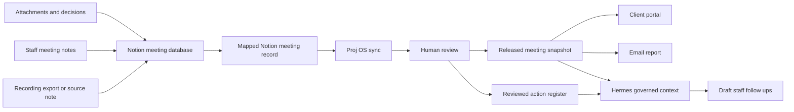

# Proj OS Notion And Hermes Meeting Intelligence

## Purpose

Proj OS needs a clean meeting intelligence boundary. Raw meeting capture should not live in Proj OS as a second source system. Notion is the upstream meeting workspace. Proj OS is the reviewed project management record.

The correct boundary is:

- Notion owns raw meeting notes, recording exports, source material, attachments, staff notes, comments, and working meeting pages.
- Each Proj OS user connects their own Notion account or workspace through the Proj OS public Notion OAuth integration.
- Proj OS imports approved Notion meeting records into the client and project meeting journal.
- Proj OS owns reviewed actions, release snapshots, client portal visibility, email delivery, and audit.
- Hermes can read governed project context and draft summaries or staff follow ups, but it cannot publish, email, or overwrite client records without human approval.

Plain English operating roles:

- **Notion:** working notes, meeting pages, knowledge, source material, attachments, and staff collaboration.
- **Hermes:** finds, summarizes, organizes, and drafts from connected sources.
- **Proj OS:** controlled project records, approved actions, client releases, financial or schedule authority, email delivery, portal visibility, and audit.

## User Journey

1. APAS enables the Proj OS public Notion integration.
2. Each user can connect their own business Notion workspace/account when their meeting databases or pages need to feed a project.
3. Recording exports, phone notes, staff notes, source material, and attachments are saved into Notion first.
4. A project manager opens the Proj OS client or project meeting journal.
5. Proj OS syncs the mapped Notion meeting record into the correct client and project.
6. A human reviews the synced meeting narrative, sections, and action candidates.
7. A human assigns actions, marks review status, and decides what is client visible.
8. Proj OS releases a dated snapshot to the client portal.
9. Proj OS can email the approved report from the same screen.
10. Hermes can use approved context to draft staff follow ups and intelligence, subject to role permissions.

## Data Flow



## Permission Model

### APAS Notion Workspace Connection

The APAS workspace connection is used for shared operating pages, meeting templates, project documentation, and reusable staff context.

Required controls:

- Workspace level OAuth connection.
- Public install scope, so authorized Proj OS users can connect their own Notion workspaces without sharing one APAS personal token.
- Tenant scoped token storage.
- Admin only connection management.
- Explicit page or database mapping per client or project.
- Audit log for every sync.
- No client visible release directly from Notion.

### User Notion Connections

User connections are for personal staff pages, meeting notes, or task lists that belong to that user.

Required controls:

- User scoped OAuth connection.
- User can disconnect at any time.
- Proj OS can only read user selected pages or databases.
- Proj OS can use authorized comment capabilities only through explicit product actions and human approval.
- Private user content does not become client visible until a Proj OS human release.

### Accepted Notion Capability Direction

The Notion console configuration should support broad collaboration for authorized pages and databases:

- Read content.
- Update content.
- Insert content.
- Read comments.
- Insert comments.
- User information, including email.

This is a capability ceiling, not an automatic behavior. Proj OS must still enforce tenant and project boundaries, selected page/database mappings, human review, and explicit user actions before syncing, commenting, updating, releasing, or emailing anything.

### Client Boundary

Clients should not see Notion plumbing. They see only approved meeting reports, action status, and client visible comments in the portal.

## Hermes Boundary

Hermes should operate through Proj OS APIs and MCP style tools.

Allowed:

- Read approved project context.
- Draft meeting summaries from synced Notion records.
- Draft staff instructions.
- Suggest action items.
- Prepare email drafts.
- Answer internal questions using released and draft context based on role.

Not allowed:

- Publish to the client portal.
- Send email to clients.
- Change project financial records.
- Override locked project data.
- Read raw Notion meeting sources outside the user's permission scope.

## Verified Connection Status, 2026-09-22

The direct Hermes to Notion connection has been partially verified on the personal desktop Hostinger profile:

- Hostinger Hermes backend updated from `0.20.1` to `0.21.4`.
- Backend health reported healthy after the update.
- User approved Notion OAuth on the active Hostinger profile.
- Hermes discovered 45 Notion MCP tools.
- Minimal read only `notion-list-private-pages(limit:1)` returned HTTP 200 without an RPC or tool error.
- Desktop Notion tool list loaded without an Authenticate warning.

This means Hermes can currently be used as a working assistant to read connected Notion context and help find or summarize material. It does not mean the full meeting intelligence workflow is complete.

The personal desktop Hermes to Proj OS MCP connection has also been verified on the active Hostinger profile:

- Proj OS MCP authentication now uses OAuth on the personal desktop profile rather than the old literal bearer configuration.
- `hermes mcp test proj_os` connected with OAuth 2.0 and discovered 35 tools.
- A direct read only `proj_os_health` call returned HTTP 200, `isError: false`, `connection_mode: workspace_dynamic`, and `project_count: 53`.
- Hermes Desktop MCP JSON was saved in OAuth form and MCP was reloaded.

This proves the personal desktop Hermes profile can read Proj OS through MCP. It does not verify Proj OS writes, client releases, financial changes, or restricted production runtime readiness.

The Proj OS to Notion foundation has also been moved forward:

- Remote Supabase schema now has `notion_connections`, `notion_project_mappings`, and `notion_sync_runs`.
- `notion` Edge Function is deployed and active with JWT verification enabled.
- `notion-oauth-callback` Edge Function is deployed and active as a public callback.
- Smoke test: unauthenticated `notion` control request returns `401`, as expected.
- Smoke test: invalid callback state redirects safely to `https://projos.ai/settings?notion=error`.
- Remote `oauth-token` and `proj-os-mcp` functions are active. The personal desktop Hostinger Hermes profile has now used this path successfully through OAuth, discovering 35 tools and passing the read only `proj_os_health` check.

What prevents full completion today:

- Supabase secrets `NOTION_OAUTH_CLIENT_ID` and `NOTION_OAUTH_CLIENT_SECRET` are not configured.
- Without those secrets, Proj OS cannot produce a valid Notion authorization URL and cannot exchange the callback code for a token.
- The Proj OS settings UI for Notion is local in this branch and not yet part of an approved frontend release.
- A restricted production Hermes credential and write authority model remain unverified. The verified personal desktop OAuth path is not production automation approval.

Required Notion callback URL:

```text
https://xlfwzqpixlrnntzqhvcm.supabase.co/functions/v1/notion-oauth-callback
```

Not yet verified:

- Writing to Notion.
- Inserting or resolving Notion comments.
- Specific meeting summarization workflows end to end.
- Proj OS public Notion OAuth consent and code exchange end to end.
- Hermes to Proj OS calls from the restricted production profile.
- Hermes writes to Proj OS through approved tools.
- Proj OS sync from mapped Notion records into reviewed project actions.

Important distinction:

- The direct Hermes vendor Notion MCP OAuth connection is separate from the APAS Proj OS public Notion OAuth registration.
- The personal desktop Hermes profile is separate from a restricted production runtime.
- Configured broad Notion capabilities are not proof that any production workflow has been implemented.

## Practical Workflow Now

Use this process until the production Proj OS integration is completed:

1. Put meeting notes, recording exports, decisions, attachments, and source material into Notion.
2. Ask Hermes to find the relevant Notion page or database record.
3. Ask Hermes to summarize decisions, commitments, risks, open questions, and suggested follow ups.
4. Treat Hermes output as a draft working product.
5. Review the draft as a human before copying it into Proj OS, sending it, or releasing it to a client.
6. When the Proj OS integration is live, map the Notion source to the correct client and project.
7. Proj OS then prepares proposed project actions and client releases from the mapped source.
8. A human approves official Proj OS records, emails, portal releases, and client visible updates.

Concrete R4 example:

1. R4 project meeting notes are captured in Notion.
2. Hermes summarizes the meeting and identifies commitments such as follow up documents, owner decisions, subcontractor actions, schedule impacts, or billing items.
3. Hermes drafts project specific action candidates.
4. When the Proj OS workflow is connected, Proj OS compares those candidates with the R4 project record, current schedule, financial controls, and client release status.
5. APAS reviews and approves the official actions.
6. Only approved actions or snapshots are released to the R4 client portal or emailed to the client.

## Product Screens

### Staff Meeting Hub

The staff hub should show:

- Meeting journal by client.
- Notion sync status.
- Mapped Notion source record for the selected meeting.
- Human review fields.
- Action assignment.
- Approved release snapshot.
- Email report button.
- Notion and Hermes intelligence status panel.

The staff hub must not show a first party transcript uploader or paste box. Existing legacy source records may remain in protected storage for audit and recovery, but new meeting capture routes through Notion.

### Client Portal

The client portal should show:

- Released meeting reports.
- Client visible action register.
- Comment and update area.
- Completion submission, if assigned.
- No raw transcripts.
- No internal Notion sync details.

### Admin Integration Panel

The admin integration panel should show:

- APAS Notion workspace connection.
- User Notion connections.
- Project and client page mappings.
- Sync logs.
- Failed syncs.
- Hermes agent access rules.
- Last indexed time by client and project.

## Implementation Sequence

1. Keep using the existing client meeting hub as the canonical reviewed meeting UI.
2. Remove the visible source upload and direct paste meeting record workflow from Proj OS.
3. Add a visible Notion source panel so staff understand that raw meeting capture starts in Notion.
4. Add Notion OAuth tables and token vaulting.
5. Add page or database mapping by client and project.
6. Add a Notion sync action that creates private source records and draft meeting sections, not client releases.
7. Add Hermes project tools that can draft, summarize, and create review candidates only.
8. Add admin sync monitoring.
9. Add client portal polish for released meeting reports.

## OAuth Configuration Contract

The code-owned OAuth callback route is:

```text
<SUPABASE_URL>/functions/v1/notion-oauth-callback
```

Required Edge Function secrets:

```text
NOTION_OAUTH_CLIENT_ID
NOTION_OAUTH_CLIENT_SECRET
NOTION_OAUTH_AUTH_URL
```

`NOTION_OAUTH_AUTH_URL` is optional when the standard Notion authorization endpoint is used. The callback and secrets must be configured in Supabase and Notion before any end to end OAuth claim is made.

## Current State

Already present in Proj OS:

- Client meeting journal.
- Human review and release workflow.
- Client portal publication snapshot.
- PDF download.
- Email delivery for approved meeting reports.
- Draft only API surface for agents.
- Legacy source records in the backend for audit and older records.

Changed now:

- The visible app no longer asks users to upload meeting source material or paste raw meeting records into Proj OS.
- The visible app explains that source notes, recordings, attachments, and staff drafts go to Notion first.
- The visible app positions Proj OS as the reviewed project action, release, email, and portal layer.
- Local Proj OS code now has the public Notion OAuth contract, token vault schema, callback route, settings card, safe status surface, selected source search, and project/client mapping foundation.
- Direct Hermes to Notion read access has been verified on the personal desktop Hostinger profile, but that verification is not the same as Proj OS production sync.
- Personal desktop Hermes to Proj OS read access has been verified through OAuth on the active Hostinger profile: 35 tools discovered and `proj_os_health` returned HTTP 200, `isError: false`, `connection_mode: workspace_dynamic`, and `project_count: 53`.
- Proj OS Notion schema and the two Notion Edge Functions are now deployed in Supabase as an isolated integration deployment.
- Remote `oauth-token` and `proj-os-mcp` are active. The personal desktop Hostinger Hermes profile has now used this path successfully through OAuth, discovering 35 tools and passing the read only `proj_os_health` check.

Missing production pieces:

- Supabase secrets for the Notion client ID and client secret.
- Verified Notion console redirect URI and capabilities against the deployed callback.
- Sync job and failure monitor.
- Hermes specific meeting intelligence UI controls.
- End to end OAuth test from Proj OS to Notion and back.
- Restricted production Hermes credential confirmation and write authority model. Personal desktop read access is verified, but writes and production automation are not.
